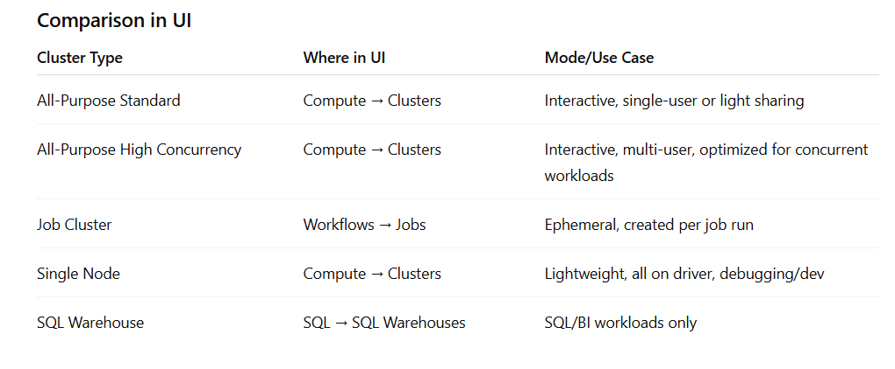
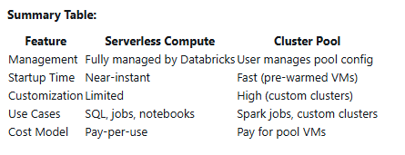

## Clusters
In Databricks, clusters are the compute resources you spin up to run notebooks, jobs, queries, or streaming. In Databricks, clusters are the core compute resources that you use to run notebooks, jobs, queries, and streaming workloads.  You can customize cluster hardware and install additional libraries (Python, Scala, etc.) as needed for your workloads.  Broadly, there are different types of clusters, each optimized for a specific use case:

### 1. All-Purpose Clusters (Standard)
- Designed for interactive and collaborative analysis.
- Can be created, restarted, and terminated manually.
- Multiple users can share these clusters to work together in real time.
- Ideal for ad-hoc analytics, data exploration, and development work.
- Typically used when working in notebooks.
- Good for ad-hoc queries, ML experimentation, and prototyping.
- Can be configured with auto termination, which shuts down the cluster after a specified idle time. This helps control costs by reducing idle resources and ensuring that you are not paying for compute resources that are not being used
- Lifecycle: manual
- Use case: interactive work in notebooks, data exploration, development, ML experimentation.
- Modes: Standard → default execution model, simpler isolation. High Concurrency → a mode you can select, which makes the cluster optimized for many concurrent users (like analysts running queries).
- Autoscaling

### 2. Job Clusters
- Created automatically by the Databricks job scheduler when you run a job (scheduled pipelines, ETL, batch processing).
- Optimized for running production jobs and workflows.
- These clusters are ephemeral: they are spun up for the duration of the job and terminated when the job completes (more cost-efficient).
- You cannot restart a job cluster; a new one is created for each job run.
- Recommended for non-interactive, automated workloads such as ETL pipelines and scheduled jobs
- They don’t have a “high concurrency” mode like all-purpose clusters.
- You define the cluster config inside the job settings. you can specify either a task-level cluster (created and terminated for each task) or a shared job cluster (shared across multiple tasks in the same job). The cluster configuration is included as part of the job definition, and you can specify the cluster settings directly within the job's JSON configuration.
- Ensures clean environment per job execution.
- Job clusters cannot be shared interactively in notebooks; they are dedicated to the job run and not available for ad-hoc or collaborative interactive use.
- Lifecycle: automated
- Autoscaling

### 3. High Concurrency Clusters (All-Purpose High Concurrency)
- A mode of All-Purpose cluster designed to serve many users or jobs concurrently. Interactive like standard all-purpose clusters, but better for multiple concurrent users.
- Can attach notebooks and SQL endpoints.
- Supports table access control, which is often required in multi-user environments.
- Optimized for workloads like: SQL dashboards, BI tools, shared notebooks, or multi-user notebooks.
- Uses fine-grained resource sharing and better task scheduling.
- Uses fine-grained scheduling to isolate tasks between users.
- Best suited when you have many users running small, short queries simultaneously.
- Can run Spark jobs more efficiently when multiple users are active at the same time.
- The "high concurrency" mode is a feature specific to all-purpose clusters.
- Autoscaling

### 4. Single Node Clusters (All-Purpose with just one node)
- Single Node Clusters are a special type of All-Purpose cluster
- Runs everything on a single driver node (no workers).
- Useful for lightweight workloads, debugging, unit testing, and some small ML tasks.
- Cheaper since you don’t allocate multiple workers.
- Cluster type: technically an All-Purpose cluster, but configured to run everything on the driver node (no worker nodes).
- Cannot be High Concurrency.
- Cheaper and simpler, but not suited for parallel workloads.
- Autoscaling is not available. Autoscaling requires a range of worker nodes to scale between, but a single node cluster consists of only the driver node and does not have any worker nodes to add or remove. Therefore, autoscaling cannot be enabled for single node clusters.

### 5. SQL Warehouses (formerly SQL Endpoints)
- Databricks SQL warehouses are another type of compute resource, specifically optimized for SQL analytics workloads.
- Technically not “clusters” but often treated similarly.
- Optimized compute layer for Databricks SQL.
- Good for running BI queries via tools like Power BI, Tableau, or Databricks SQL UI.
- They auto-scale differently than normal clusters.
- Autoscaling
- You can increase the cluster size to handle more concurrent queries, improve performance, or reduce query latency. The cluster size determines the compute resources (driver and worker nodes) allocated to your SQL warehouse.
- For serverless SQL warehouses, you should start with a larger size than you think you need and then size down as you test. Increasing the "t-shirt size" (such as Small, Medium, Large, etc.) will allocate more resources, which can help if your queries are spilling to disk, are highly parallelizable, or if you are running multiple queries at a time. You can also add more clusters for autoscaling to further increase concurrency and throughput
- For pro and classic SQL warehouses, the cluster size directly maps to specific driver and worker node types and counts. For example, a "Large" cluster size will have more workers and larger driver nodes than a "Small" cluster size. This allows you to scale up your SQL endpoint as your workload grows
- To change the cluster size: Go to the SQL warehouse (endpoint) settings in the Databricks UI. Adjust the cluster size (t-shirt size) as needed. Save and restart the warehouse for the changes to take effect. This flexibility allows you to optimize for both performance and cost as your usage patterns change

Optional configurations that apply across cluster types:
- Standard vs. High Concurrency mode (applies to all-purpose clusters).
- Autoscaling (cluster automatically adds/removes workers based on load). autoscaling in Databricks allows clusters to automatically add or remove worker nodes based on the current workload. This helps optimize both cost and performance by ensuring that you have enough resources when demand is high and reducing resources when demand is low. Autoscaling can be enabled for various workloads, including ETL and streaming pipelines, and is especially beneficial for workloads with variable or unpredictable resource requirements. For example, in Lakeflow Declarative Pipelines, you can enable enhanced autoscaling, which optimizes cluster utilization by dynamically allocating resources as needed, with minimal impact on processing latency. Enhanced autoscaling can proactively shut down under-utilized nodes and is the default mode for new pipelines.
- Pools (warm clusters for faster startup).

## How the different cluster types actually appear in the Databricks UI

### 1. All-Purpose Clusters 
You create them yourself from the “Compute” tab → “Create Cluster”. Single Node Clusters and High Concurrency clusters are a special type of All-Purpose cluster so they appear here.
In the creation form you’ll see:
- Cluster Mode → choose Standard or High Concurrency.
- Cluster Policy (if your admin enforces limits).
- Worker/driver node sizes, autoscaling options, etc.

For single node clusters:
- Compute → Create Cluster
- Set Cluster Mode = Single Node
- Pick the driver node size (no workers to configure)
- Optional: enable auto termination after idle time

For High concurrency cluster:
- Go to Compute → Create Cluster
- Cluster Mode: choose High Concurrency
- Configure: Worker & driver node sizes, Auto-scaling, Spark version, libraries, and termination settings

Once created, they show up in Compute → All Clusters with a green (running) or grey (terminated) status. In notebooks → you attach your notebook to this cluster.

### 2. Job Clusters
You don’t create them directly in Compute → Create Cluster. 
Instead, they show up when you configure a Job (from the “Workflows” tab):
- In the job settings, you choose New Job Cluster or Existing All-Purpose Cluster.
- If you pick New Job Cluster, the cluster is created just for that run, then terminated.

In Compute → All Clusters you won’t usually see them as permanent entries — only temporarily if they’re running.

### 3. SQL Warehouses (formerly SQL Endpoints)
They don’t show up under Compute → Clusters. Instead, you see them in the SQL persona (left menu → SQL Warehouses). They look like separate compute resources, where you define size (e.g., Small, Medium, Large) and auto-stop behavior. Used when you run SQL queries in Databricks SQL editor or connect BI tools.

## Cluster Access Modes for Unity Catalog

To ensure compatibility with Unity Catalog, you must use clusters with either standard access mode (formerly called shared access mode) or dedicated access mode (formerly called single-user or assigned access mode). Only clusters configured with one of these access modes can access data in Unity Catalog. All serverless compute and Databricks SQL compute also support Unity Catalog

Best practice:
Databricks recommends using standard access mode for all workloads. Use dedicated access mode only if your required functionality is not supported by standard access mode.

**Cluster Access Modes for Unity Catalog**

When creating an All-Purpose cluster, you have an Access Mode setting:
- Dedicated Access Mode (formerly called Single User): Only the assigned user (or group, in preview) can use the cluster. Also compatible with Unity Catalog. Recommended only if you need functionality not supported by Standard mode, or for certain ML workloads.

- Standard Access Mode (formerly called Shared/Multiple Users): Allows multiple users to attach notebooks and run workloads concurrently. Provides secure, governed access to Unity Catalog tables and metadata. Recommended for most workloads and collaborative environments. Required for high concurrency and multi-user scenarios with Unity Catalog.

- No Isolation / Legacy Modes (e.g., No Isolation Shared, Credential Passthrough): Not compatible with Unity Catalog. Do not use these modes if you need to access Unity Catalog data, as they do not enforce UC permissions and may break UC features. 

- Only clusters with Standard or Dedicated access mode can access Unity Catalog data.
- Databricks recommends Standard access mode for most use cases.
- Access mode is set in the cluster configuration under the Advanced section.
- For Databricks Runtime ML clusters, Dedicated access mode is required to access Unity Catalog

## Serveless compute vs cluster
In Databricks, you can choose between serverless compute and clusters (all-purpose or jobs compute) depending on your workload and requirements:

**Serverless Compute:**
- Databricks automatically manages the compute resources for you.
- You don’t need to configure or manage clusters manually.
- Ideal for SQL workloads and interactive analytics, as it provides instant and scalable compute.
- Serverless compute is optimized for ease of use and efficiency, especially when you want to avoid cluster management overhead
- Autoscaling

**Clusters (All-purpose or Jobs Compute):**
- You configure and manage the clusters yourself.
- All-purpose clusters are used for interactive, collaborative analysis.
- Jobs compute clusters are recommended for non-interactive, automated workloads (like scheduled jobs or ETL pipelines)
- You have more control over the cluster size, libraries, and configuration.

- Use serverless compute for SQL analytics and when you want Databricks to handle scaling and management automatically.
- Use jobs compute clusters for production jobs and workflows.
- Use all-purpose clusters for development, exploration, and collaborative work.

## Cluster pool
A cluster pool in Databricks is a set of idle, ready-to-use virtual machine instances that can be used to reduce cluster start and auto-scaling times. When you attach a cluster to a pool, the cluster's driver and worker nodes are allocated from the pool, which helps speed up cluster startup and scaling because the resources are already provisioned and waiting

Key points about cluster pools:
- When a cluster attached to a pool is terminated, its instances are returned to the pool and can be reused by other clusters, improving resource utilization and reducing costs.
- You can attach a cluster to a pool during cluster creation by selecting the pool from the Driver Type or Worker Type dropdown in the UI, or by specifying the pool IDs in the Clusters API.
- Pools can be configured to use spot instances to save costs, but if spot instances are evicted, they are not replaced by on-demand instances in pool-based clusters.
- For best performance, create pools based on the specific instance types and Databricks runtimes your organization uses most frequently (e.g., separate pools for data engineering, data science, and analytics workloads).
- If your workload supports serverless compute, Databricks recommends using serverless compute instead of pools to take advantage of always-on, scalable compute.
- Autoscaling

## Serveless compute vs Cluster pool
Serverless compute and cluster pools in Databricks both aim to optimize resource usage and reduce wait times, but they serve different purposes and offer distinct benefits:

**Serverless Compute**
- Databricks fully manages the compute resources for you. You don’t need to configure, start, or manage clusters.
- Ideal for SQL workloads (via serverless SQL warehouses), jobs, and interactive notebooks if your workspace is enabled for serverless interactive compute.
- Near-zero startup latency: Compute resources are instantly available, so you don’t wait for clusters to start.
- No cluster management: Databricks handles all infrastructure, scaling, and optimization.
- Pay for what you use: Billing is based on actual usage, not on cluster uptime.
- Improved concurrency: Supports high query concurrency and fast scaling.
- No admin overhead: Cloud administrators don’t need to manage quotas, networks, or billing connections
- Best for: Teams that want simplicity, instant compute, and minimal infrastructure management.

**Cluster pools**
- A pool is a set of pre-initialized, idle virtual machines (VMs) that clusters can use. When you start a cluster attached to a pool, it draws from these pre-warmed VMs, reducing cluster startup time.
- Useful for organizations that run many short-lived clusters or jobs and want to minimize cluster startup delays.
- Faster cluster startup: Clusters start quickly by using pre-allocated VMs from the pool.
- Resource reuse: When a cluster is terminated, its VMs return to the pool for reuse.
- Cost control: Pools can be configured to use spot instances for cost savings, but if spot VMs are evicted, they are not replaced by on-demand VMs.
- Custom configuration: You can tailor pools for specific instance types or workloads.
- Best for: Teams that need custom cluster configurations, want to reduce startup times, but still want control over cluster settings.

Key Differences
- Management: Serverless compute is fully managed by Databricks; cluster pools require you to manage pool configuration.
- Startup Time: Serverless offers near-instant compute; pools offer faster (but not instant) cluster startup.
- Flexibility: Pools allow custom cluster configurations; serverless is more standardized.
- Use Cases: Serverless is best for SQL, jobs, and interactive notebooks (if enabled); pools are best for Spark workloads needing custom clusters and fast startup.

