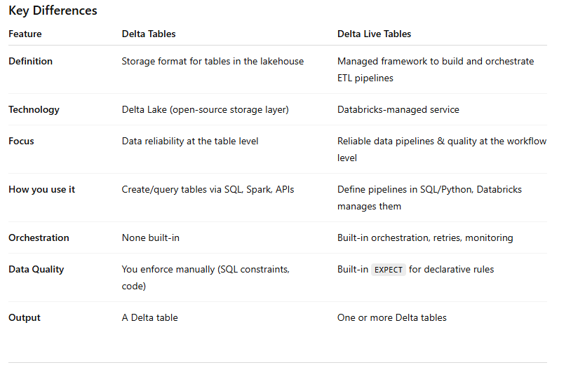

## Difference between Delta Tables and  Delta Live Tables.

Delta Tables are a storage format built on top of Parquet that adds powerful features like:
- ACID transactions
- Time travel (query past versions)
- Schema enforcement and evolution
- Efficient upserts/merges (no need to rewrite entire files)
- Data skipping and Z-ordering

You can use Delta Tables in batch and streaming workloads with Spark, and they are the foundation of the Lakehouse architecture.

✅ Delta Tables are about how data is stored and managed (Data storage & management)
- Storage format based on Delta Lake.
- They are tables stored in your data lake (e.g., in S3, ADLS, GCS) using Parquet + a transaction log (_delta_log).

Use case:
- Reliable, versioned, transactional tables in your lakehouse.
- You query them directly (SQL, Spark, pandas API on Spark).

Think of Delta tables as the storage layer that makes your data lake behave like a data warehouse.


Delta Live Tables is a managed framework for building data (ETL) pipelines on top of Delta Tables. It provides:
- Declarative pipeline development using SQL or Python
- Automatically handles dependency resolution, job orchestration, retries, monitoring
- Automatic dependency tracking between tables
- Built-in data quality checks (EXPECT clauses for constraints and rules)
- Orchestration and monitoring
- Incremental processing for both batch and streaming
- Continuous or triggered mode for streaming + batch unification
- Versioning and lineage tracking
- Automatic creation of underlying Delta tables as pipeline outputs

DLT simplifies the creation and maintenance of ELT pipelines, and it automatically handles many operational concerns like retries, schema inference, and scaling.

✅ Delta Live Tables are about how data pipelines are built and executed (Pipeline orchestration & logic)

Use case:
- When you want to transform raw data → silver → gold in a production-ready, managed, and monitored way.
- DLT handles the complexity of scheduling, orchestration, data quality enforcement, and logging.

Think of Delta Live Tables as the pipeline service, and it produces/maintains Delta tables as outputs.





## Delta Table Example (Storage Layer)
You can create and query a Delta table directly in Databricks (SQL or PySpark).

SQL
```
-- Create a Delta table
CREATE TABLE sales_delta
USING DELTA
AS
SELECT * FROM parquet.`/mnt/raw/sales_data/`;

-- Query the table
SELECT product_id, SUM(amount) AS total_sales
FROM sales_delta
GROUP BY product_id;
```
PySpark
```
from pyspark.sql import SparkSession

spark = SparkSession.builder.getOrCreate()

# Read raw parquet
df = spark.read.parquet("/mnt/raw/sales_data/")

# Write as Delta table
df.write.format("delta").mode("overwrite").saveAsTable("sales_delta")

# Query
result = spark.sql("SELECT COUNT(*) FROM sales_delta")
result.show()
```


## Delta Live Tables (Pipeline Framework)
With DLT, you don’t just create a table—you define a pipeline of transformations.

SQL (DLT Pipeline)
```
CREATE OR REFRESH LIVE TABLE bronze_sales
AS SELECT * FROM cloud_files("/mnt/raw/sales/", "json");

CREATE OR REFRESH LIVE TABLE silver_sales
AS SELECT product_id, CAST(amount AS DOUBLE) AS amount, date
FROM LIVE.bronze_sales;

CREATE OR REFRESH LIVE TABLE gold_sales_summary
AS SELECT product_id, SUM(amount) AS total_sales
FROM LIVE.silver_sales
GROUP BY product_id;
```

- LIVE keyword → managed by DLT.
- The dependencies are automatic: gold depends on silver, silver depends on bronze.
- If bronze updates, DLT will trigger downstream tables.

```
import dlt
from pyspark.sql.functions import col

@dlt.table
def bronze_sales():
    return (
        spark.readStream.format("json").load("/mnt/raw/sales/")
    )

@dlt.table
@dlt.expect("valid_amount", "amount > 0")  # data quality check
def silver_sales():
    return (
        dlt.read("bronze_sales")
        .withColumn("amount", col("amount").cast("double"))
    )

@dlt.table
def gold_sales_summary():
    return (
        dlt.read("silver_sales")
        .groupBy("product_id")
        .sum("amount")
    )
```

- DLT manages orchestration between bronze → silver → gold.
- It enforces data quality rules (expect) and drops/bad-record handling automatically.
- The underlying tables are stored as Delta tables.


So the difference in code:

Delta Tables → you write/read them like any database table.

Delta Live Tables → you declare a pipeline of transformations, and Databricks manages the orchestration, quality, and produces Delta tables as the output.


## The bronze table of DLT

The bronze table can be created from either batch or streaming data, depending on how you set it up in the DLT pipeline.

Stream
```
@dlt.table
def bronze_sales():
    return spark.readStream.format("json").load("/mnt/raw/sales/")
```
Because we used readStream, the bronze layer ingests streaming data (e.g., new JSON files landing continuously in /mnt/raw/sales/). That means every time new files arrive, DLT will pick them up and update downstream silver/gold tables.

Batch
```
@dlt.table
def bronze_sales():
    return spark.read.format("json").load("/mnt/raw/sales/")
```
Now, bronze ingests a static batch snapshot of all files in /mnt/raw/sales/. You could trigger the pipeline on a schedule (e.g., once per day) to refresh it.