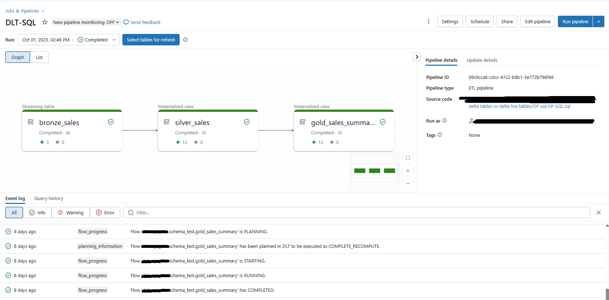
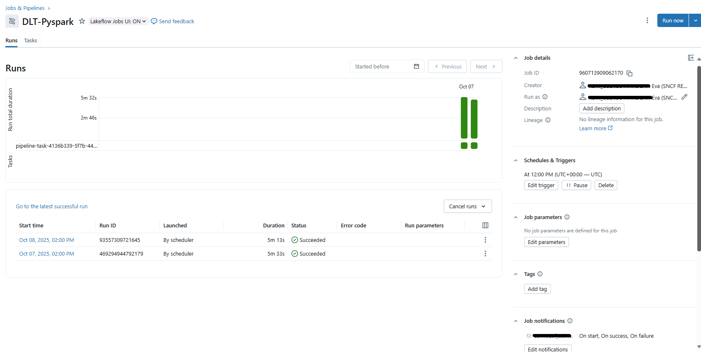
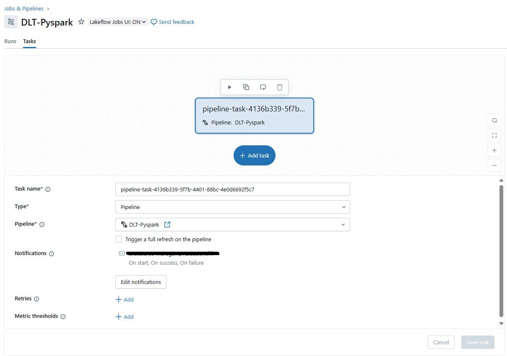

## From June 2025, Databricks introduced new naming for both DLT and Jobs/Workflows.
Databricks Jobs (i.e. Workflows) is now called Lakeflow Jobs
- June 11, 2025
- The product known as Databricks Jobs is now Lakeflow Jobs. No migration is required to use Lakeflow Jobs.

DLT (Delta Live Tables) is now called Lakeflow Declarative Pipelines
- June 11, 2025
- The product known as DLT is now Lakeflow Declarative Pipelines. No migration is required to use Lakeflow Declarative Pipelines.

Reference: https://docs.databricks.com/gcp/en/release-notes/product/2025/june


Implications

- The functionality of DLT / Jobs is preserved; this is more of a branding & naming change, though some new features accompany it. 
- “No migration required” language is used: you don’t need to manually remap everything; it’s mostly a rename under the hood. 
- Some API changes (e.g. AUTO CDC replacing APPLY CHANGES) are being encouraged in Lakeflow Declarative Pipelines. 


## Difference between Databricks Lakeflow Declarative Pipelines and Workflows.
They’re both orchestration/automation tools in Databricks, but they serve different purposes:


### Lakeflow Declarative Pipelines
What it is: A framework for declarative data pipelines. Instead of writing procedural ETL jobs, you define what tables you want and how they are derived, and pipelines manages the execution.

When you create a Lakeflow Declarative Pipelines, you define your transformations in SQL or Python (via PySpark).

Main focus: Data pipeline development and reliability.

Features:

- Handles incremental processing natively with Delta Lake.
- Automatic data quality enforcement (with expectations).
- Built-in lineage tracking.
- Auto-scaling and recovery if a pipeline fails.
- Best when you want to manage Bronze → Silver → Gold tables in a Medallion architecture.

Analogy: Think of it like dbt inside Databricks, but with runtime management, scaling, and error handling baked in.

Pipeline definition is always tied to a notebook or a Python script.
- You define your transformations in SQL or Python inside a notebook (or optionally, a .py script from Repos).
- Without that, the pipeline has nothing to run — because it is declarative and must know your table definitions.

A notebook with python or sql, a .py file or a .sql file is required as source code with the description of the tables and transformations.



## Databricks Workflows
It is a general-purpose orchestration tool for any jobs in Databricks.

Main focus: Job scheduling and orchestration (not just data pipelines). When you schedule a lakeflow declarative pipeline on the UI pipeline page (for example, run the pipeline every day at 12am), you are creating a workflow job.

The job cluster will stop after the tasks are completed. If you create a job from a streaming pyspark query (not a lakeflow declarative pipeline), the job cluster will run indefinitely if you do not indicate in you code `query.stop()` after your processing logic. From AI databrocks assistant:

> To schedule a PySpark streaming query as a job in Azure Databricks, follow these steps:
> - Develop your streaming query in a Databricks notebook using PySpark.
> - Save the notebook.
> - In the Databricks workspace, go to Jobs & Pipelines.
> - Create a new job and select your notebook as the task.
> - Add a trigger to schedule the job (choose Simple or Advanced scheduling options).
> - When the job runs, it will execute your streaming query on the cluster according to the schedule.
>
> Databricks recommends using jobs compute (not all-purpose clusters) for production streaming workloads. If you use the continuous trigger in your streaming query, Databricks will automatically restart the job on failure and prevent concurrent runs. You do not need to call awaitTermination() in your notebook; the job will manage the streaming query lifecycle for you
>
> To stop a PySpark streaming query so that your job finishes, you should call the .stop() method on the StreamingQuery object. This will gracefully stop the streaming computation and allow your job to complete
>
> To ensure your processing logic is complete before calling query.stop(), you should:
> - Place all necessary processing steps before the query.stop() call.
> - If you need to wait for the streaming query to process all available data (for example, in micro-batch mode), use query.processAllAvailable() before stopping the query. This method blocks until all available data has been processed.
>
> This approach ensures that your streaming job processes all data up to the current point before shutting down the query gracefully. If you do not call query.stop() (or do not otherwise terminate the streaming query), your PySpark streaming job will continue running indefinitely and the job will not finish on its own. This is because streaming queries are designed to run continuously, processing new data as it arrives.
>
> You cannot use query.awaitTermination() as a replacement for query.stop().
> - query.awaitTermination() blocks the code execution and waits for the streaming query to finish (for example, if it is stopped from another thread or fails).
> - query.stop() actively stops the streaming query.
>
> If you want to programmatically stop the query, you must call query.stop(). If you only call query.awaitTermination(), the query will keep running indefinitely unless stopped elsewhere.

Features:

- Run any type of task: notebooks, Spark jobs, SQL queries, ML model training, Python scripts, even external tasks.
- Build multi-task workflows with dependencies (like Airflow or Prefect, but inside Databricks).
- Can include Lakeflow Declarative pipelines as a task in the workflow.
- Good for orchestrating end-to-end processes: ingestion → transformation → ML scoring → dashboard refresh.

Analogy: Think of it as Airflow built into Databricks, but with native integration.

✅ Does not require a notebook. You can orchestrate without ever touching one.
Much more flexible: Can run a notebook task, Or run a Python script, JAR, SQL statement, dbt task, or shell command.




## Key Difference
Lakeflow Declarative Pipelines = specialized for data pipelines (transformations + quality + lineage).

Workflows = general orchestration tool (runs Lakeflow Declarative Pipelines pipelines and any other tasks).


## Example Use Case:
Use pipelines to create your Silver and Gold tables with expectations for data quality.

Use Workflows to:
- Trigger the pipeline,
- Run ML training on the Gold table,
- Send notifications if something fails,
- Refresh dashboards afterwards.


## Languages Supported in Lakeflow Declarative Pipelines
SQL

- You can create tables with CREATE STREAMING TABLE ... AS SELECT ...
- Perfect for declarative transformations.

Example:
```
CREATE OR REFRESH STREAMING TABLE bronze_sales
AS
SELECT 
*,
current_timestamp() AS processing_time,
_metadata.file_name AS file
 FROM STREAM read_files(
  '/Volumes/sales/json/',
  format => 'json',
  multiline => 'true'
);

CREATE OR REFRESH MATERIALIZED VIEW silver_sales
AS SELECT Id, CAST(money AS DOUBLE) AS money, processing_time, file
FROM bronze_sales;

CREATE OR REFRESH MATERIALIZED VIEW gold_sales_summary
AS SELECT Id, SUM(money) AS total_sales
FROM silver_sales
GROUP BY Id;
```

Python (PySpark or SQL inside Python)

You write functions that return a DataFrame and decorate them with @dp.table (or @dp.view).

Example:
```
from pyspark import pipelines as dp
from pyspark.sql.functions import col

@dp.table(
    comment="Filtered orders with non-null status"
)
def silver_orders():
    return (
        dp.read("bronze_orders")
          .where(col("status").isNotNull())
    )
```

Not Supported: Scala, R, Raw Spark jobs outside of PySpark/SQL context

Lakeflow Declarative Pipelines is intentionally restricted to SQL + Python so it can:
- Track lineage automatically,
- Apply data quality expectations,
- Optimize execution,
- Make pipelines declarative and reproducible.


## Languages Supported in Databricks Workflows
Workflows are not tied to one language. Instead, they can orchestrate any type of task you can run in Databricks.

Supported task types (and thus languages):
- Databricks Notebook → can be in Python, SQL, Scala, or R (depending on cluster/runtime).
- Lakeflow Declarative Pipelines → (which itself is SQL/Python, as we said).
- Python Script (from DBFS, Repos, or remote source).
- Spark JAR task → for Scala/Java.
- SQL task → runs SQL queries directly in a SQL warehouse.
- dbt task → if you integrate dbt with Databricks.
- Shell command task → for system-level commands.

You could create a Workflow that:
- Runs a Python notebook to ingest data,
- Triggers a Lakeflow Declarative Pipelines (SQL/Python) to process raw → silver → gold,
- Runs a Scala JAR task for complex ML feature engineering,
- Runs a SQL task to refresh a dashboard table,
- Sends a Slack notification with a Python script.

Comparison with Lakeflow Declarative Pipelines
- Lakeflow Declarative Pipelines: SQL & Python only → specialized for declarative pipelines.
- Workflows: Language-agnostic → orchestrates any task type (Python, SQL, Scala, R, Java, dbt, shell, etc.).


## Databricks UI
When you go to the Jobs & Pipelines tab, you’ll see options like:
- Ingestion pipeline
- ETL pipeline
- Job


-> Lakeflow Declarative Pipelines

If you click Ingestion pipeline or ETL pipeline, you are creating a Lakeflow Declarative Pipelines.

Both options bring you to the same pipeline creation flow — the only difference is the preset template:
- Ingestion pipeline → usually preconfigures Auto Loader for streaming ingestion into a Bronze table.
- ETL pipeline → gives you a blank pipeline where you define your own Bronze → Silver → Gold logic.


-> Jobs

If you click Job, you’re creating a Databricks Workflow job.
This is for orchestrating notebooks, JARs, SQL tasks, Python scripts, etc.
Not a Lakeflow Declarative Pipelines pipeline (though you can call it as a task inside a Workflow).


## Jobs vs Pipelines
In Databricks certification context:

Jobs = Workflows
- A Job in the UI = a Databricks Workflow.
- It’s the general-purpose orchestration engine.
- Can run notebooks, Python scripts, SQL, JARs, dbt, shell commands, or even pipelines as tasks.


Pipelines = Lakeflow Declarative Pipelines
- A Pipeline in the UI = a Lakeflow Declarative Pipelines
- Specialized for data ingestion and ETL (Bronze → Silver → Gold).
- Written only in SQL or Python (PySpark).
- Brings built-in lineage, expectations, auto-scaling, and reliability.

## Emailing query results to a user
You can use Databricks Workflows to email query results to a user. This is a common use case for Workflows.
> To run a job in Databricks, execute a SQL query, and email the results, you typically need to:
> - Run the SQL query in a notebook or job.
> - Collect the results (e.g., as a Pandas DataFrame or CSV).
> - Send the results via email using an SMTP server.
> - Here’s a step-by-step example using PySpark and Python’s smtplib:
> ```import smtplib
> from email.mime.multipart import MIMEMultipart
> from email.mime.text import MIMEText
>
> # 1. Run your SQL query
> df = spark.sql("SELECT * FROM your_table LIMIT 10")
> result_html = df.toPandas().to_html(index=False)
>
> # 2. Set up email parameters
> sender = "your_email@example.com"
> receiver = "recipient@example.com"
> subject = "Databricks SQL Query Results"
> body = f"Here are the results:<br><br>{result_html}"
>
> # 3. Create the email message
> msg = MIMEMultipart()
> msg['From'] = sender
> msg['To'] = receiver
> msg['Subject'] = subject
> msg.attach(MIMEText(body, 'html'))
>
> # 4. Send the email (using your SMTP server)
> with smtplib.SMTP("smtp.yourserver.com", 587) as server:
>     server.starttls()
>     server.login("your_username", "your_password")
>     server.sendmail(sender, receiver, msg.as_string())
>```
> Notes:
> - You must have access to an SMTP server (e.g., Gmail, Outlook, or your company’s server).
> -For sensitive credentials, use Databricks secrets or environment variables.
> - For large result sets, consider attaching a CSV file instead of embedding HTML.
> 
> Alternative: If you use Databricks Jobs, you can configure job email notifications for job success/failure, but not for sending query results directly. For custom content, use the above approach in a notebook task.


## manage jobs in Databricks programmatically
You can create and manage jobs in Databricks programmatically using the Databricks REST API or the Databricks CLI. This allows you to automate job creation, scheduling, and management without using the Databricks UI.

Here are the general steps to create a job using Python and the Databricks API:
- Authenticate: Obtain an access token or API key to authenticate your requests to the Databricks API.
- Create a Job Definition: Define the job details such as the notebook path, cluster configuration, and schedule.
- Submit the Job: Use the API to submit the job for execution.

Here is an example using the Databricks CLI in Python to create a job:
```
import subprocess

# Define the job configuration in JSON format
job_config = {
    "name": "MyJob",
    "new_cluster": {
        "spark_version": "7.3.x",
        "node_type_id": "Standard_DS3_v2",
        "num_workers": 2
    },
    "notebook_task": {
        "notebook_path": "/Users/myuser/my-notebook"
    },
    "schedule": {
        "quartz_cron_expression": "0 15 10 ? * *"
    }
}

# Write the job configuration to a temporary JSON file
with open("job_config.json", "w") as file:
    json.dump(job_config, file)

# Use the Databricks CLI to create the job
subprocess.run(["databricks", "jobs", "create", "--json-file", "job_config.json"])

```
You can also achieve similar functionality using the Databricks REST API directly in Python by making HTTP requests to the Databricks API endpoints.

```
import requests
import json

# --- create a job using the Databricks API ---

# Define your Databricks API token
token = "YOUR_DATABRICKS_API_TOKEN"

# Define the base URL for the Databricks API
base_url = "https://<databricks-instance>/api/2.0/"

# Define the headers with the authorization token
headers = {
    "Authorization": f"Bearer {token}",
    "Content-Type": "application/json"
}

# Define the job configuration
job_config = {
    "name": "MyJob",
    "new_cluster": {
        "spark_version": "7.3.x",
        "node_type_id": "Standard_DS3_v2",
        "num_workers": 2
    },
    "notebook_task": {
        "notebook_path": "/Users/myuser/my-notebook"
    },
    "schedule": {
        "quartz_cron_expression": "0 15 10 ? * *"
    }
}

# Create the job using the Databricks API
response = requests.post(base_url + "jobs/create", headers=headers, data=json.dumps(job_config))

if response.status_code == 200:
    print("Job created successfully.")
else:
    print("Error creating job:", response.text)


# --- list all jobs using the Databricks API ---
# Example: Get a list of jobs in the workspace
response = requests.get(base_url + "jobs/list", headers=headers)

if response.status_code == 200:
    jobs = response.json()["jobs"]
    for job in jobs:
        print(job["settings"]["name"])
else:
    print("Error fetching jobs:", response.text)
```

Please refer to the Databricks API documentation for more details on how to interact with the API programmatically: [Databricks API](https://docs.databricks.com/aws/en/reference/api)

## Types of triggers in the streaming pyspark
- Default: process each micro-batch as soon as the previous one has been processed.
- Fixed interval: micro_batches are processed at a fixed interval time specified by the user. `.trigger(processingTime='10 seconds')`
- One-time: process all available data as a single micro-batch and then stop the query. `.trigger(once=True)`
- Available-now: like trigger once, available data processed before query stops, but in multiple batches instead of one. `.trigger(availableNow=True)`
- Continuous processing: long-running taks that continuously read, process and write data as soon as it arrives. `.trigger(continuous='1 second')`