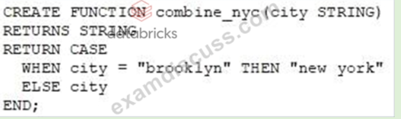
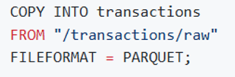
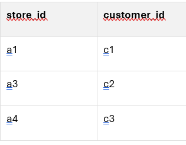
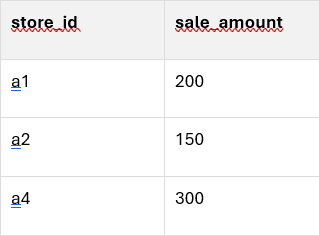
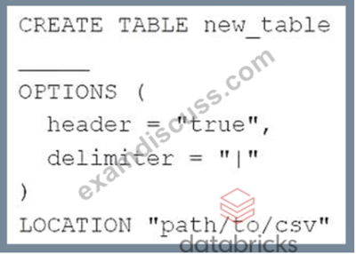
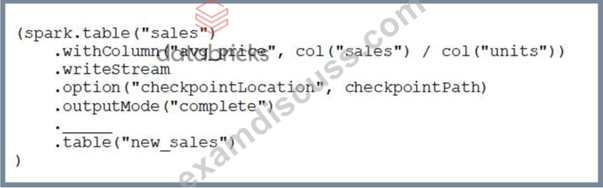
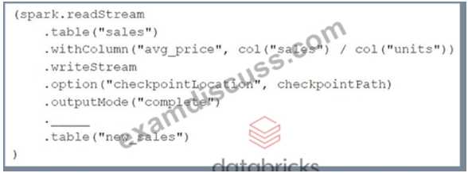
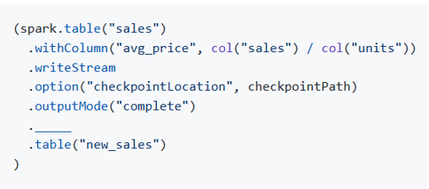

# Databricks Data Engineer Associate Practice Exam Questions

## **Question**
A data organization leader is upset about the data analysis team’s reports being different from the data engineering team’s reports. The leader believes the siloed nature of their organization’s data engineering and data analysis architectures is to blame. Which of the following describes how a data lakehouse could alleviate this issue?

*Answer*

### Both teams would use the same source of truth for their work

-------------------------------------------------------------------------------------------------------------------------
## **Question**
A data engineer has three notebooks in an ELT pipeline. The notebooks need to be executed in a specific order for the pipeline to complete successfully. The data engineer would like to use Delta Live Tables to manage this process. Which of the following steps must the data engineer take as part of implementing this pipeline using Delta Live Tables?

*Answer*

### They need to create a Delta Live Tables pipeline from the Jobs page.

-------------------------------------------------------------------------------------------------------------------------
## **Question**
A dataset has been defined using Delta Live Tables and includes an expectations clause:
```CONSTRAINT valid_timestamp EXPECT (timestamp > '2020-01-01')```
What is the expected behavior when a batch of data containing data that violates these constraints is processed?

*Answer*

### Records that violate the expectation are added to the target dataset and recorded as invalid in the event log.

**Explanation:** This is the default behavior when using the EXPECT clause without specifying an action like ON VIOLATION DROP ROW or ON VIOLATION FAIL UPDATE.

Optional behaviors:

Drop records → `ON VIOLATION DROP ROW`

Fail pipeline → `ON VIOLATION FAIL UPDATE`

-------------------------------------------------------------------------------------------------------------------------
## **Question**
A data engineer has written the following query:

```
SELECT *
FROM json.`/path/to/json/file.json`;
```

The data engineer asks a colleague for help to convert this query for use in a Delta Live Tables (DLT) pipeline. The query should create the first table in the DLT pipeline.
Which of the following describes the change the colleague needs to make to the query?

*Answer*

### They need to add a CREATE LIVE TABLE table_name AS line at the beginning of the query.

**Explanation:** To convert a standard SQL query into a Delta Live Tables (DLT) SQL pipeline, you must define a live table using the CREATE LIVE TABLE syntax. This tells DLT to treat the result of the query as a managed table in the pipeline.

-------------------------------------------------------------------------------------------------------------------------
## **Question**
A data engineering team has created a series of tables using Parquet data stored in an external system. The team is noticing that after appending new rows to the data in the external system, their queries within Databricks are not returning the new rows. They identify the caching of the previous data as the cause of this issue. Which of the following approaches will ensure that the data returned by queries is always up-to-date?

*Answer*

### The tables should be converted to the Delta format

**Explanation:** When using external Parquet tables, Spark SQL may cache metadata and data, leading to stale query results if the underlying files are updated outside of Spark. Delta Lake solves this by:
- Tracking metadata and schema changes
- Supporting ACID transactions
- Automatically handling data consistency
- Enabling time travel and data skipping

By converting the tables to Delta format, the data engineering team ensures that queries always reflect the latest data, even after appends or updates.

-------------------------------------------------------------------------------------------------------------------------
## **Question**
Which of the following Structured Streaming queries is performing a hop from a Bronze table to a Silver table?

*Answer*

```
(spark.table("sales")
.withColumn("avgPrice", col("sales") / col("units"))
.writeStream
.option("checkpointLocation", checkpointPath)
.outputMode("append")
.table("cleanedSales"))
```

**Explanation:** This query represents a hop from a Bronze table to a Silver table in the medallion architecture:
- Bronze layer: Contains raw, ingested data (e.g., sales table).
- Silver layer: Contains cleaned and enriched data, such as derived columns, filtered records, or joined datasets.

In this case:
- The sales table is assumed to be raw data (Bronze).
- The transformation adds a new column avgPrice, which is a form of data enrichment.
- The result is written to a new table cleanedSales, which fits the Silver layer.

-------------------------------------------------------------------------------------------------------------------------
## **Question**
A table customerLocations exists with the following schema:
```
id STRING,
date STRING,
city STRING,
country STRING
A senior data engineer wants to create a new table from this table using the following command:
CREATE TABLE customersPerCountry AS
SELECT country,
COUNT(*) AS customers
FROM customerLocations
GROUP BY country;
```
A junior data engineer asks why the schema is not being declared for the new table.
Which of the following Answers explains why declaring the schema is not necessary?

*Answer*

### CREATE TABLE AS SELECT statements adopt schema details from the source table and query.

**Explanation:** When using a CREATE TABLE AS SELECT (CTAS) statement in Spark SQL (and Databricks), the schema of the new table is automatically inferred from the result of the SELECT query. This means: You don’t need to declare the schema manually. Spark uses the column names and data types from the query result to define the schema of the new table

-------------------------------------------------------------------------------------------------------------------------
## **Question**
Which of the following commands will return records from an existing Delta table my_table where duplicates have been removed?

*Answer*

`SELECT DISTINCT * FROM my_table;`

**Explanation:** To remove duplicates from the result set of a query in Spark SQL (or Databricks SQL), you use the SELECT DISTINCT statement. This returns only unique rows from the table, effectively filtering out duplicates without modifying the underlying table.

-------------------------------------------------------------------------------------------------------------------------
## **Question**
A data engineer wants to horizontally combine two tables as a part of a query. They want to use a shared column as a key column, and they only want the query result to contain rows whose value in the key column is present in both tables. Which of the following SQL commands can they use to accomplish this task?

*Answer*

### INNER JOIN

-------------------------------------------------------------------------------------------------------------------------
## **Question**
A junior data engineer has ingested a JSON file into a table raw_table with the following schema:

```
cart_id STRING,
items ARRAY<item_id:STRING>
```

The junior data engineer would like to unnest the items column in raw_table to result in a new table with the following schema:

```
cart_id STRING,
item_id STRING
```

Which of the following commands should the junior data engineer run to complete this task?

*Answer*

### `SELECT cart_id, explode(items) AS item_id FROM raw_table;`

**Explanation:** To unnest or flatten an array column in Spark SQL (or Databricks SQL), you use the EXPLODE() function. It transforms each element in the array into a separate row, which is exactly what's needed 

-------------------------------------------------------------------------------------------------------------------------
## **Question**
A data engineer has ingested a JSON file into a table raw_table with the following schema:
```
transaction_id STRING,
payload ARRAY<customer_id:STRING, date:TIMESTAMP, store_id:STRING>
```
The data engineer wants to efficiently extract the date of each transaction into a table with the following schema:
```
transaction_id STRING,
date TIMESTAMP
```
Which of the following commands should the data engineer run to complete this task?

*Answer*

### `SELECT transaction_id, payload.date FROM raw_table;`

-------------------------------------------------------------------------------------------------------------------------
## **Question**
A data analyst has provided a data engineering team with the following Spark SQL query:
```
SELECT district,
avg(sales)
FROM store_sales_20220101
GROUP BY district;
```
The data analyst would like the data engineering team to run this query every day. The date at the end of the table name (20220101) should automatically be replaced with the current date each time the query is run.
Which of the following approaches could be used by the data engineering team to efficiently automate this process?

*Answer*

### They could wrap the query using PySpark and use Python’s string variable system to automatically update the table name.

-------------------------------------------------------------------------------------------------------------------------
## **Question**
A data engineer has ingested data from an external source into a PySpark DataFrame raw_df. They need to briefly make this data available in SQL for a data analyst to perform a quality assurance check on the data. Which of the following commands should the data engineer run to make this data available in SQL for only the remainder of the Spark session?

*Answer*

### `raw_df.createOrReplaceTempView("raw_df")`

**Explanation:** This command registers the PySpark DataFrame raw_df as a temporary view named "raw_df" that can be queried using Spark SQL within the current Spark session. The view only lasts for the duration of the Spark session — perfect for short-term tasks like QA checks.
- `raw_df.createTable("raw_df")`  Not a valid PySpark method.
- `raw_df.write.save("raw_df")`   Saves data to storage, not for SQL querying.
- `raw_df.saveAsTable("raw_df")`  Creates a permanent table, not temporary.

-------------------------------------------------------------------------------------------------------------------------
## **Question**

A data engineer needs to dynamically create a table name string using three Python variables: region, store, and year. An example of a table name is below when region = "nyc", store = "100", and year = "2021": nyc100_sales_2021 Which of the following commands should the data engineer use to construct the table name in Python?

*Answer*

### `f"{region}{store}sales{year}"`

-------------------------------------------------------------------------------------------------------------------------
## **Question**

A data engineer has developed a code block to perform a streaming read on a data source. The code block below is returning an error:
```
(spark
.read
.schema(schema)
.format("cloudFiles")
.option("cloudFiles.format", "json")
.load(dataSource)
)
```
Which of the following changes should be made to the code block to configure the block to successfully perform a streaming read?

*Answer*

### The .read line should be replaced with .readStream.

**Explanation:** To perform a streaming read in PySpark using Auto Loader (cloudFiles), you must use: spark.readStream instead of: spark.read. This tells Spark that you're initiating a structured streaming job, which is required for reading data continuously from a source like cloud storage.

-------------------------------------------------------------------------------------------------------------------------
## **Question**
A data engineer has configured a Structured Streaming job to read from a table, manipulate the data, and then perform a streaming write into a new table.
The code block used by the data engineer is below:
```
(spark.table("sales")
.withColumn("avg_price", col("sales") / col("units"))
.writeStream
.option("checkpointLocation", checkpointPath)
.outputMode("complete")
._____
.table("new_sales")
)
```
If the data engineer only wants the query to execute a single micro-batch to process all of the available data, which of the following lines of code should the data engineer use to fill in the blank?

*Answer*

### `trigger(once=True)`

-------------------------------------------------------------------------------------------------------------------------
## **Question**
A data engineering team is in the process of converting their existing data pipeline to utilize Auto Loader for incremental processing in the ingestion of JSON files. One data engineer comes across the following code block in the Auto Loader documentation:
```
(streaming_df = spark.readStream.format("cloudFiles")
.option("cloudFiles.format", "json")
.option("cloudFiles.schemaLocation", schemaLocation)
.load(sourcePath))
```
Assuming that schemaLocation and sourcePath have been set correctly, which of the following changes does the data engineer need to make to convert this code block to use Auto Loader to ingest the data?

*Answer*

### There is no change required. The inclusion of format("cloudFiles") enables the use of Auto Loader.

**Explanation:** Auto Loader is activated in Databricks by using: `format("cloudFiles")`
This tells Spark to use Databricks' Auto Loader for incremental and efficient ingestion of files from cloud storage (e.g., S3, ADLS, GCS). The .option("cloudFiles.format", "json") specifies the format of the incoming files.
As long as:
- schemaLocation is set to a valid path for storing inferred schemas (this is the location where auto loader track schema evolution and avoid re-infering the schema every time the stream starts, it should be a persistent path, ideally in DBFS or mounted cloud storage)
- sourcePath points to the correct cloud directory (this is the location of the data files you want to ingest, it points to a directory in cloud storage eg S3, ADLS or DBFS where new files are expected to arrive)

...then no additional changes are needed to use Auto Loader.

sourcePath ->	Where the data files are located	-> "s3://my-bucket/data/json/"

schemaLocation ->	Where schema metadata is stored ->	"dbfs:/schemas/json_ingest/"

-------------------------------------------------------------------------------------------------------------------------
## **Question**
Which of the following data workloads will utilize a Bronze table as its source?

*Answer*

### A job that enriches data by parsing its timestamps into a human-readable format

**Explanation:** In the medallion architecture used in the Databricks Lakehouse Platform, data is typically organized into three layers:
- Bronze: Raw, ingested data—often semi-structured or unstructured, and ingested from streaming or batch sources. This layer captures data as-is, with minimal transformation.
- Silver: Cleaned and enriched data—includes filtering, joins, and parsing.
- Gold: Aggregated and business-level data—used for reporting, dashboards, and ML features.

So, a job that ingests raw data from a streaming source fits the Bronze layer, as it’s the first step in the pipeline.

-------------------------------------------------------------------------------------------------------------------------
## **Question**
Which of the following data workloads will utilize a Silver table as its source?

*Answer*

### A job that aggregates cleaned data to create standard summary statistics

-------------------------------------------------------------------------------------------------------------------------
## **Question**
A data engineer is overwriting data in a table by deleting the table and recreating the table. Another data engineer suggests that this is inefficient and the table should simply be overwritten instead. Which of the following reasons to overwrite the table instead of deleting and recreating the table is incorrect?

*Answer*

### Overwriting a table results in a clean table history for logging and audit purposes.

**Explanation:** This statement is incorrect because overwriting a Delta table does not result in a clean history. In fact, one of the key features of Delta Lake is that it preserves the table history, even when you overwrite the data. This allows for: Time Travel to previous versions, Auditability of changes, Debugging and rollback capabilities

-------------------------------------------------------------------------------------------------------------------------
## **Question**
Which of the following statements describes Delta Lake?

*Answer*

### Delta Lake is an open format storage layer that delivers reliability, security, and performance.

**Explanation:** Delta Lake is an open-source storage layer that brings ACID transactions, schema enforcement, time travel, and scalable metadata handling to data lakes. It enhances reliability and performance for big data workloads on platforms like Databricks.

-------------------------------------------------------------------------------------------------------------------------
## **Question**
Which of the following approaches can the data engineer use to obtain a version-controllable configuration of the Job's schedule and configuration?

*Answer*

### They can download the JSON equivalent of the job from the Job's page

**Explanation:** Databricks allows data engineers to export the JSON configuration of a job directly from the job's UI. This JSON includes: Job name, Schedule, Tasks, Cluster configuration, Libraries, Parameters. By downloading and version-controlling this JSON (e.g., storing it in a Git repository), engineers can: Track changes over time, Reuse or redeploy jobs programmatically via the Databricks Jobs API, Integrate with CI/CD pipelines

-------------------------------------------------------------------------------------------------------------------------
## **Question**
Which of the following benefits of using the Databricks Lakehouse Platform is provided by Delta Lake?

*Answer*

### The ability to support batch and streaming workloads

**Explanation:** This is a key benefit of the data lakehouse architecture that is not available in traditional data warehouses:
- A data lakehouse combines the scalability and flexibility of data lakes with the structured data management and performance of data warehouses.
- It supports both batch and streaming data processing on the same platform and data, enabling real-time analytics and historical reporting together.

-------------------------------------------------------------------------------------------------------------------------
## **Question**
Which of the following code blocks will remove the rows where the value in column age is greater than 25 from the existing Delta table my_table and save the updated table?

*Answer*

### `DELETE FROM my_table WHERE age > 25;`

-------------------------------------------------------------------------------------------------------------------------
## **Question**
Which part of the Databricks Platfrom can a data engineer use to revoke permissions from users on tables?

*Answer*

### Data Explorer (Catalog Explorer)

-------------------------------------------------------------------------------------------------------------------------
## **Question**
Which of the following data lakehouse features results in improved data quality over a traditional data lake?

*Answer*

### A data lakehouse supports ACID-compliant transactions.

-------------------------------------------------------------------------------------------------------------------------
## **Question**
A data architect is designing a data model that works for both video-based machine learning workloads and highly audited batch ETL/ELT workloads. Which of the following desctibes how using a data lakehouse can help the data architect meet the needs of both workloads?

*Answer*

### A data lakehouse stores unstructured data and is ACID-complaint.

**Explanation:** This statement highlights a unique benefit of the data lakehouse architecture:
- A data lakehouse can store unstructured data (like video, images, logs) in open formats such as Parquet, making it suitable for machine learning workloads.
- At the same time, it provides ACID transaction guarantees through technologies like Delta Lake, which is essential for audited batch ETL/ELT workloads.
- This combination of flexibility (for ML) and reliability (for ETL) is not available in traditional data warehouses, which typically only support structured data and lack native support for unstructured formats.

-------------------------------------------------------------------------------------------------------------------------
## **Question**
In the Databricks environment, when working with Delta tables to ensure data consistency, which specific command allows you to write data into a Delta table while preventing the inclusion of duplicate records?

*Answer*

### MERGE

**Explanation:** The MERGE command in Databricks is used to merge a source DataFrame into a target Delta table. It allows you to insert new records and update or delete existing ones based on a condition. This helps in avoiding the writing of duplicate records by ensuring that only new or modified records are inserted or updated, respectively.

MERGE command is used to write data into a Delta table while avoiding the writing of duplicate records. It allows to perform an "upsert" operation, which means that it will insert new records and update existing records in the Delta table based on a specified condition. This helps maintain data integrity and avoid duplicates when adding new data to the table.

-------------------------------------------------------------------------------------------------------------------------
## **Question**
In which of the following scenarios should a data engineer use the MERGE INTO command instead of the INSERT INTO command?

*Answer*

### When the target table cannot contain duplicate records

-------------------------------------------------------------------------------------------------------------------------
## **Question**
A data analyst has successfully created a Delta table named sales, which is extensively used by the entire data analysis team for various reporting and analytical tasks. Seeking to maintain the integrity and cleanliness of this data, they have requested assistance from the data engineering team to implement a suite of thorough data validation tests. Notably, while the data analyst team primarily leverages SQL for their operations, the data engineering team prefers using Python within the PySpark framework for their testing procedures. Considering this context, which command should the data engineering team utilize to access the sales Delta table in PySpark?

*Answer*

### `Spark.table(“sales”)`

**Explanation:** The command `spark.table("sales")` is used in PySpark to access a table named 'sales'. This method is appropriate for use by the data engineering team that prefers Python over SQL. 
- Option `SELECT * FROM sales` is a SQL query and not valid in a PySpark context. 
- Option `spark.sql("sales")` is incorrect because it seems to be incorrectly formatted for querying a table using spark.sql() which requires a SQL statement. 
- Option `spark.delta.table("sales")`, is not a valid PySpark method.

spark.table() function in PySpark allows access to a registered table within the SparkSession.

-------------------------------------------------------------------------------------------------------------------------
## **Question**
In a scenario where a data engineer initiates the creation of a new database using the command:
`CREATE DATABASE IF NOT EXISTS customer360;`
Determine the default location where the 'customer360' database will be stored within the Databricks environment.


*Answer*

### Dbfs:/user/hive/warehouse

**Explanation:** By default, databases created in Databricks are stored in the Hive warehouse directory, which is typically 'dbfs:/user/hive/warehouse'. This is the default location used to store the metadata for databases and tables unless explicitly specified otherwise when creating the database.

[Databricks Data Engineering Preparation Question 8: Where Does Your Databricks Database Live? | by THE BRICK LEARNING | Towards Data Engineering | Medium](https://medium.com/towards-data-engineering/databricks-data-engineering-preparation-question-8-where-does-your-databricks-database-live-67b86f8d9843)

-------------------------------------------------------------------------------------------------------------------------
## **Question**
A data engineer needs to create a database called customer360 at the location /customer/customer360. The data engineer is unsure if one of their colleagues has already created the database. Which of the following commands should the data engineer run to complete this task?

*Answer*

`CREATE DATABASE IF NOT EXISTS customer360 LOCATION '/customer/customer360';`

-------------------------------------------------------------------------------------------------------------------------
## **Question**
In a scenario where a data engineer is working with Spark SQL and attempts to delete a table named 'my_table' by executing the command: DROP TABLE IF EXISTS my_table;, the engineer observes that both the data files and metadata files related to the table are removed from the file system. What is the underlying reason for the deletion of all associated files?

*Answer*

### The table was managed

**Explanation:** When a managed table is dropped in Spark SQL, both the data files and the metadata are deleted from the file system. This is because managed tables are fully controlled by Spark, including their storage locations and lifecycle.

-------------------------------------------------------------------------------------------------------------------------
## **Question**
A junior data engineer needs to create a Spark SQL table my_table for which Spark manages both the data and the metadata. The metadata and data should also be stored in the Databricks Filesystem (DBFS). Which of the following commands should a senior data engineer share with the junior data engineer to complete this task?

*Answer*

### `CREATE TABLE my_table (id STRING, value STRING);`

**Explanation:** This command creates a managed Spark SQL table in Databricks. In a managed table:
- Spark manages both the data and the metadata
- The data is stored in the Databricks Filesystem (DBFS) under the default warehouse location (usually /user/hive/warehouse)
- You don’t need to specify a path or format — Spark handles it automatically

incorrect:
- USING org.apache.spark.sql.parquet OPTIONS (PATH …): Creates an external table, not managed.
- CREATE MANAGED TABLE … OPTIONS (PATH …): Invalid syntax—managed tables don’t use OPTIONS(PATH …). 
- CREATE MANAGED TABLE …: Not valid SQL syntax; MANAGED is not a keyword in Spark SQL.
- USING DBFS: DBFS is not a valid format specifier.

-------------------------------------------------------------------------------------------------------------------------
## **Question**
In the context of executing a CREATE TABLE AS SELECT statement in Databricks, what is one advantage of creating an external table using Parquet format over using CSV format?

*Answer*

### Parquet files have a well-defined schema

**Explanation:** While Parquet files can indeed be optimized and partitioned, the key benefit mentioned in the context of using a CREATE TABLE AS SELECT statement is that Parquet files have a well-defined schema. This allows for better schema enforcement and metadata handling compared to CSV files, which do not natively include schema information.

-------------------------------------------------------------------------------------------------------------------------
## **Question**
As a data engineer, you are given a table named stores that contains a column named city, which holds string values representing the names of cities. You need to apply some custom logic to the city column as part of a specific data processing use case. To implement this custom logic efficiently across the dataset within Databricks, you want to create a SQL user-defined function (UDF). Which of the following code blocks will allow you to create this SQL UDF?

*Answer*

### `CREATE FUNCTION custom_logic(city STRING) RETURNS STRING RETURN UPPER(city);`

**Explanation:** The correct way to define a SQL user-defined function (UDF) in Databricks is by using the CREATE FUNCTION syntax. This option follows this syntax correctly by creating a function named custom_logic, taking a string argument city, and returning the uppercase version of the input string. 

Other options either use incorrect syntax (e.g., CREATE UDF instead of CREATE FUNCTION) or incorrect logic (e.g., RETURNS CASE WHEN).

-------------------------------------------------------------------------------------------------------------------------
## **Question**
A data engineer needs to apply custom logic to string column city in table stores for a specific use case. In order to apply this custom logic at scale, the data engineer wants to create a SQL user-defined function (UDF).
Which of the following code blocks creates this SQL UDF?

*Answer*



**Explanation:**

[Introducing SQL User-Defined Functions | Databricks Blog](https://www.databricks.com/blog/2021/10/20/introducing-sql-user-defined-functions.html)

-------------------------------------------------------------------------------------------------------------------------
## **Question**
A data analyst is working with a SQL program that consists of a series of queries. The requirement is to automate the execution of this program on a daily basis. However, there is a specific condition: the final query within the program should only be executed on Sundays. The data analyst has reached out to the data engineering team for assistance in implementing this scheduling logic. Which of the following approaches can the data engineering team utilize to achieve this goal?

*Answer*

### They could wrap the queries using PySpark and use Python’s control flow system to determine when to run the final query

**Explanation:** Wrapping the queries using PySpark and using Python's control flow system to determine when to run the final query is the most feasible solution. This approach allows precise control over which part of the code runs and when, which fits the requirement of running the final query only on Sundays. 

Other options like submitting a feature request, running the entire program on Sundays, restricting access to the source table, or redesigning the data model are either not practical, overly complex, or do not address the requirement directly.

-------------------------------------------------------------------------------------------------------------------------
## **Question**
A data engineer is responsible for executing a daily operation that involves copying sales data from the previous day into a table named transactions. The sales data for each day is stored in separate files located in the directory "/transactions/raw". To perform today’s data copying task, the data engineer runs a specific command. However, after executing the command, the data engineer observes that the number of records in the transactions table remains unchanged. 
 


Which of the following could explain why the command did not add any new records to the table

*Answer*

### The previous day’s file has already been copied into the table.

**Explanation:** The COPY INTO statement is generally used to copy data from files or a location into a table. If the data engineer runs this statement daily to copy the previous day's sales into the 'transactions' table and the number of records hasn't changed after today's execution, it is possible that the data from today's file might not have differed from the data already present in the table. The COPY INTO operation is idempotent, meaning that files already loaded will be skipped. Hence, if the previous day's file has already been copied into the table, no new records will be added.

-------------------------------------------------------------------------------------------------------------------------
## **Question**
A data engineer has to create a table named new_employees_table in Databricks, utilizing data from their organization’s existing SQLite database. The following command is executed: 

```
CREATE TABLE new_employees_table 
USING _____ 
OPTIONS ( 
    url '<jdbc_url>',
    dbtable '<table_name>', 
    user '<username>', 
    password '<password>' 
    ) 
    AS SELECT * FROM employees_table_vw
```
Which line of code correctly fills in the blank to allow the successful creation of the table?

*Answer*

### `Org.apache.spark.sql.jdbc`

**Explanation:** To create a table in Databricks from an existing SQLite database, the appropriate connector for JDBC must be specified. The correct line to fill in the blank is 'org.apache.spark.sql.jdbc', which allows Databricks to read from JDBC-compliant databases. 

-------------------------------------------------------------------------------------------------------------------------
## **Question**
A data engineering team manages retail transaction data across different months. They have two specific tables: the first table, named march_transactions, contains all retail transactions recorded in the month of March, and the second table, named april_transactions, holds all retail transactions for the month of April. It is assured that there are no duplicate records between these two tables. To consolidate this data, which of the following commands should be executed to create a new table all_transactions that combines all records from both march_transactions and april_transactions, ensuring there are no duplicate records?

*Answer*
```
CREATE TABLE all_transaction AS 
    SELECT * FROM march_transactions 
    UNION 
    SELECT * FROM April_transactions;
```

**Explanation:** The UNION operator combines the result sets of two or more queries, and it automatically removes duplicate records from the results. Given that the two tables, march_transactions and april_transactions, have no duplicate records within themselves, using UNION will create a new table all_transactions that includes all records from both months without any duplicates. 

Other options like INNER JOIN, OUTER JOIN, INTERSECT, and MERGE do not provide the necessary functionality to combine the two tables while removing duplicates.

-------------------------------------------------------------------------------------------------------------------------
## **Question**
A data engineer has a Python variable table_name that they would like to use in a SQL query. They want to construct a Python code block that will run the query using table_name.
They have the following incomplete code block: 
```
____(f"SELECT customer_id, spend FROM {table_name}")
```

Which of the following can be used to fill in the blank to successfully complete the task?

*Answer*

### Spark.sql

-------------------------------------------------------------------------------------------------------------------------
## **Question**
A data engineer is working on a Python program and intends to execute a specific block of code only under certain conditions. The criteria for executing this block are that the variable day_of_week must be equal to 1, and another variable, review_period, must be set to True. Given this scenario, which of the following control flow statements should the data engineer use to initiate this conditional execution of the code block?

*Answer*

### `If day_of_week == 1 and review_period:`

**Explanation:** The correct control flow statement to begin the conditionally executed code block would be: if day_of_week == 1 and review_period:. This statement checks if the variable day_of_week is equal to 1 and if the variable review_period evaluates to a truthy value. 

The use of the double equal sign (==) in the comparison of day_of_week is crucial, as a single equal sign (=) would assign a value to the variable instead of checking its value.

-------------------------------------------------------------------------------------------------------------------------
## **Question**
In the context of managing a Spark SQL table named my_table, a data engineer wants to completely remove the table along with all its associated metadata and data. They use the command DROP TABLE IF EXISTS my_table. Although the table is no longer listed when they execute SHOW TABLES, they notice that the data files still persist. What is the reason that the data files remain in place while the metadata files were deleted?

*Answer*

### The table was external

**Explanation:** The reason why the data files still exist while the metadata files were deleted is because the table was external. When a table is external in Spark SQL (or in other database systems), it means that the table metadata (such as schema information and table structure) is managed externally, and Spark SQL assumes that the data is managed and maintained outside of the system. Therefore, when you execute a DROP TABLE statement for an external table, it removes only the table metadata from the catalog, leaving the data files intact. On the other hand, for managed tables, Spark SQL manages both the metadata and the data files. When you drop a managed table, it deletes both the metadata and the associated data files, resulting in a complete removal of the table.

-------------------------------------------------------------------------------------------------------------------------
## **Question**
A data engineer is tasked with creating a data entity derived from a combination of two tables. This data entity will be utilized by other data engineers across different sessions and must be stored at a physical location. Which type of data entity should the data engineer create?

*Answer*

### Table

**Explanation:** While views are data entities that other data engineers can use in their queries, they do not store data in a physical location as required by the question. Tables, on the other hand, are data entities that physically store data and can be accessed by multiple sessions and users concurrently. This makes them the most suitable option when the data entity must be persistent and saved to a physical location.

-------------------------------------------------------------------------------------------------------------------------
## **Question**
A data engineer wants to create a relational object by pulling data from two tables. The relational object must be used by other data engineers in other sessions **on the same cluster only**. In order to save on storage costs, the data engineer wants to avoid copying and storing physical data. Which of the following relational objects should the data engineer create?

*Answer*

### View

**Explanation:** A view is a logical object that stores a SQL query but does not store physical data. It can be used by other users in other sessions on the same cluster. Since it’s based on a query, it pulls data dynamically from the source tables, avoiding duplication and extra storage.
- Temporary view → Only available within the current session; not accessible to other users.
- External table → Refers to data stored outside of Databricks, and does store physical data.
- Managed table → Stores data physically in Databricks-managed storage, which incurs storage costs.
- Global Temporary view ?? → Accessible across sessions but only within the same Spark application, not ideal for multi-user access across sessions.

-------------------------------------------------------------------------------------------------------------------------
## **Question**
A data engineer wants to create a relational object by pulling data from two tables. The relational object must be used by other data engineers in other sessions. In order to save on storage costs, the data engineer wants to avoid copying and storing physical data. Which of the following relational objects should the data engineer create?

*Answer*

### View

-------------------------------------------------------------------------------------------------------------------------
## **Question**
A data engineer is responsible for maintaining a data pipeline that processes incoming data. Recently, the data engineer has observed that the quality of the source data has been declining. To address this issue, the data engineer seeks to implement an automated solution to monitor the quality of the incoming data. Which of the following tools can the data engineer utilize to achieve automated data quality monitoring?

*Answer*

### Delta Live Tables

**Explanation:** Delta Live Tables is a declarative framework designed specifically for building reliable, maintainable, and testable data processing pipelines. It includes built-in functionality for monitoring data quality, such as data quality checks, data lineage tracking, and alerting for failed checks. This makes it an ideal tool for automating the process of monitoring the data quality in a data pipeline.

-------------------------------------------------------------------------------------------------------------------------
## **Question**
A data engineer is maintaining a data pipeline. Upon data ingestion, the data engineer notices that the source data is starting to have a lower level of quality. The data engineer would like to automate the process of monitoring the quality level. Which of the following tools can the data engineer use to solve this problem?

*Answer*

### Delta Live Tables

**Explanation:** Delta Live Tables is a declarative framework for building reliable, maintainable, and testable data processing pipelines. You define the transformations to perform on your data and Delta Live Tables manages task orchestration, cluster management, monitoring, data quality, and error handling. Quality is explicitly mentioned in the definition.

-------------------------------------------------------------------------------------------------------------------------
## **Question**
In the context of managing and versioning projects within the Databricks environment, data engineers have the option to either utilize the built-in Databricks Notebooks versioning feature or to version their projects using Databricks Repos. Considering these two approaches, which of the following represents a key advantage of employing Databricks Repos over the native Databricks Notebooks versioning system?

*Answer*

### Databricks Repos supports the use of multiple branches

**Explanation:** While both Databricks Notebooks versioning and Databricks Repos allow for version control of code, Databricks Repos provides the additional benefit of supporting the use of multiple branches. This allows for multiple versions of a notebook or project to be developed in parallel, facilitating collaboration among team members and simplifying the process of merging changes into a single main branch.

-------------------------------------------------------------------------------------------------------------------------
## **Question**
Two junior data engineers are authoring separate parts of a single data pipeline notebook. They are working on separate Git branches so they can pair program on the same notebook simultaneously. A senior data engineer experienced in Databricks suggests there is a better alternative for this type of collabration. Which of the following supports the senior data engineer's claim?

*Answer*

### Databricks Notebooks support real-time coauthoring on a single notebook

**Explanation:** Databricks Notebooks offer real-time collaborative editing, similar to Google Docs. This means multiple users can work on the same notebook at the same time, seeing each other's changes live. This eliminates the need for branching and merging in Git for simple collaborative authoring, especially when working on the same notebook.

-------------------------------------------------------------------------------------------------------------------------
## **Question**
Which of the following describes how Databricks Repos can help facilitate CI/CD workflows on the Databricks Lakehouse Platform?

*Answer*

### Databricks Repos can facilitate the pull request, review, and approval process before merging branches

**Explanation:** Databricks Repos integrate directly with Git providers (like GitHub, GitLab, Bitbucket, Azure DevOps), allowing users to sync notebooks and other files with remote repositories. 
- This integration supports standard Git workflows. 
- This makes it ideal for CI/CD pipelines, where code quality, version control, and automated deployment are essential.

Other options:
- Merge changes from a secondary Git branch: Merging is done via the Git provider, not directly within Databricks Repos.
- Design, develop, and trigger Git automation pipelines: Databricks Repos don’t trigger pipelines directly; external CI/CD tools (like GitHub Actions or Azure Pipelines) handle that.
- Store the single-source-of-truth Git repository: The Git provider stores the source of truth, not Databricks Repos.
- Commit or push code changes to trigger a CI/CD process??: While commits can trigger CI/CD, Databricks Repos themselves don’t initiate this, they rely on Git integrations.

-------------------------------------------------------------------------------------------------------------------------
## **Question**
In an organization, a data engineer who previously managed several Delta tables in Databricks has recently left the company. The data team now needs to reassign ownership of these Delta tables to a new data engineer, who is the lead engineer on the team. Given that the original data engineer no longer has access to the system, identify which individual is responsible for transferring the ownership of these Delta tables in Data Explorer to the new lead data engineer.

*Answer*

### Worksapce administrator

**Explanation:** The Workspace Administrator typically has the necessary permissions to manage and transfer ownership of resources such as Delta tables. The new lead data engineer, without the required administrative permissions, would not be able to facilitate this transfer. Since the original data engineer no longer has access, the Workspace Administrator is the appropriate individual to perform this task.

-------------------------------------------------------------------------------------------------------------------------
## **Question**
A data analyst has created a Delta table named 'sales' that serves the entire data analysis team. To ensure the data quality, the analyst seeks assistance from the data engineering team to implement a series of validation tests. However, the data engineering team prefers using Python for these tests instead of SQL. Which of the following commands could the data engineering team use to access the 'sales' Delta table in PySpark?

*Answer*

### `Spark.table(“sales")`

**Explanation:** The spark.table() function in PySpark allows you to access tables registered in the catalog, including Delta tables. By specifying the table name ('sales'), the data engineering team can read the Delta table and perform various operations on it using PySpark. 

- Option (SELECT * FROM sales) is SQL syntax and cannot be directly used in PySpark. 
- Option is incorrect because PySpark provides the capability to interact with data using both SQL and DataFrame/DataSet APIs. 
- Option (spark.sql('sales')) is not valid SQL syntax. 
- Option (spark.delta.table('sales')) does not exist in PySpark; the correct method is spark.table('sales').

-------------------------------------------------------------------------------------------------------------------------
## **Question**
In the context of working with Databricks, you may need to retrieve specific information about existing databases for various reasons such as understanding their structure or configurations. One common requirement might be to find the location path of a database. Given this scenario, which of the following commands will return the location of the database named customer360?

*Answer*

### `DESCRIBE DATABASE cusomer360;`

**Explanation:** The correct command to retrieve the location of a database in Databricks is 'DESCRIBE DATABASE customer360;'. This command provides information about the database, including its location, whereas the other options either perform different actions (such as dropping the database or altering its properties) or are syntactically incorrect for retrieving the database location.

-------------------------------------------------------------------------------------------------------------------------
## **Question**
A data engineer is tasked with creating a new table that contains the names of customers residing in France. To accomplish this, they have written a specific command. However, a senior data engineer advises that it is organizational policy to include a table property specifying that the new table contains personally identifiable information (PII). Which of the following lines of code should be added to the command in order to adhere to organizational policy and successfully complete the task?

*Answer*

### `COMMENT “Contains PII”`

**Explanation:** The COMMENT keyword is used to add a comment to a table. This comment can be viewed when the table is described using the DESC command. Though TBLPROPERTIES can also add metadata, it is not visible when describing the table, making COMMENT "Contains PII" the appropriate choice according to the given requirement.

-------------------------------------------------------------------------------------------------------------------------
## **Question**
To help data engineers efficiently manage and manipulate arrays within their data, Spark SQL offers a variety of array functions. These functions enhance data processing capabilities by providing tools to perform operations such as filtering, transforming, and aggregating elements of an array.
Which of the following is a benefit provided by the array functions available in Spark SQL?

*Answer*

### An ability to work with complex, nested data ingested from JSON files

**Explanation:** Array functions in Spark SQL enable users to work efficiently with arrays and complex, nested data structures that are often ingested from JSON files or other nested data formats. These functions allow manipulation, querying, and extraction of elements from arrays and nested structures within the dataset, facilitating operations on complex data types within Spark SQL.

-------------------------------------------------------------------------------------------------------------------------
## **Question**
In the context of Databricks and Delta Lake, managing and optimizing data storage while preventing duplication is critical. Delta Lake provides various functionalities to handle data efficiently. One such functionality is to ensure that no duplicate records are written into a Delta table during the data write process. Given this context, which of the following commands can be used to write data into a Delta table while avoiding the writing of duplicate records? Please select the correct option.

*Answer*

### MERGE

**Explanation:** The MERGE command in Delta Lake is used to combine the functionalities of both inserting new records and updating existing records in one atomic operation. By defining a match condition, typically based on a primary key or unique identifier, it can ensure that duplicate records are not created. This helps maintain data integrity by only inserting new records when necessary and updating existing records, thereby avoiding duplicates.

-------------------------------------------------------------------------------------------------------------------------
## **Question**
In which of the following scenarios should a data engineer use the MERGE INTO command instead of the INSERT INTO command?

*Answer*

### When the target table cannot contain duplicate records

**Explanation:** The MERGE INTO command is used when you need to perform both insertions and updates (or deletes) in one operation based on whether a match exists. It is particularly useful for maintaining up-to-date data and ensuring there are no duplicate records in the target table. This is often referred to as an 'upsert' operation (update + insert). When the target table needs to be kept free of duplicate records, and there's a need to update existing records or insert new ones based on some matching condition, MERGE INTO is the appropriate command. 

The INSERT INTO command, on the other hand, is used to add new records to a table without regard for whether they duplicate existing records. 

-------------------------------------------------------------------------------------------------------------------------
## **Question**
A data engineer needs to analyze customer preferences and store sales by combining information from two distinct tables. The first table, named favorite_stores, captures the relationship between customers and their preferred stores. The second table, named sales, records the sales amounts associated with each store. Below are the tables used in this task:

Table 1: favorite_stores



Table 2: sales



The data engineer executes the following SQL query to perform a left join between these tables:
`SELECT favorite_stores.store_id, sales.sale_amount FROM favorite_stores LEFT JOIN sales ON favorite_stores.store_id = sales.store_id;`

What will be the result set returned by this SQL query?

*Answer*

### a1 200, a3 null, a4 300

**Explanation:** In a LEFT JOIN, all records from the left table (favorite_stores) are included, and only the matching records from the right table (sales) are added. In this case, 'a1' and 'a4' from the left table match with 'a1' and 'a4' from the right table, so these matching records are fetched. Additionally, 'a3' from the left table is included, and since 'a3' has no corresponding store_id in the right table, the sale_amount for 'a3' will be NULL. Therefore, the result includes 'a1, 200', 'a3, NULL', and 'a4, 300'.

-------------------------------------------------------------------------------------------------------------------------
## **Question**
A data engineer is working on setting up a new table in Databricks that should directly read its data from an existing CSV file located at '/path/to/csv'. To achieve this, the engineer intends to use the CREATE TABLE statement. Considering that they need to specify the format of the input data as part of this SQL command, the engineer runs the following command: `CREATE TABLE my_table LOCATION '/path/to/csv'` 

Which of the following lines of code correctly completes the command, specifying the necessary format to accurately read and create the table from the CSV file?

*Answer*

### `USING CSV`

**Explanation:** To create a table in Databricks using data from a CSV file, you need to specify the format of the source data. The correct syntax after specifying the table name and schema (if applicable) is to use the USING CSV clause. This tells Databricks that the data source format is CSV.

-------------------------------------------------------------------------------------------------------------------------
## **Question**
A data engineer needs to create a table in Databricks using data from a CSV file at location /path/to/csv.
They run the following command:



Which of the following lines of code fills in the above blank to successfully complete the task?

*Answer*

### `USING CSV`

-------------------------------------------------------------------------------------------------------------------------
## **Question**
A data engineer is tasked with creating a Structured Streaming job in Databricks that reads from an existing table, processes the data, and writes the processed data into a new table in real time. The aim is to ensure that the streaming query handles all the available data by processing it in the necessary number of batches. Below is the code block used by the data engineer. Identify which line of code should be inserted to ensure that all available data is processed in multiple batches.

*Answer*

### `Trigger(availableNow=True)`

**Explanation:** In Structured Streaming, if a data engineer wants to process all the available data in as many batches as required without any explicit trigger interval, they can use the option trigger(availableNow=True). This feature, availableNow, is used to specify that the query should process the data that is available at the moment and not wait for more data to arrive.

-------------------------------------------------------------------------------------------------------------------------
## **Question**
A data engineer has created a data pipeline that ingests data from a JSON source using Auto Loader. However, the engineer did not include any type inference or schema hints in their pipeline. After evaluating the data, the engineer found that all the columns in the target table are of the string type, even though some fields contain only float or boolean values. Which of the following explains why Auto Loader inferred all the columns to be of the string type?

*Answer*

### Because JSON does not encode data types, Auto Loader defaults to inferring all columns as strings to avoid schema evolution issues.

**Explanation:** JSON does not encode data types. When Auto Loader infers the schema of JSON data, it assumes that all values are strings to avoid schema evolution issues due to type mismatches. This is why all of the columns in the target table were inferred as string type despite the presence of float or boolean values. Providing type inference or schema hints can help Auto Loader infer the correct types for columns.

-------------------------------------------------------------------------------------------------------------------------
## **Question**
A data engineer has developed a data pipeline to ingest data from a JSON source using Auto Loader, but the engineer has not provided any type inference or schema hints in their pipeline. Upon reviewing the data, the data engineer has noticed that all of the columns in the target table are of the string type despite some of the fields only including float or boolean values.

Which of the following describes why Auto Loader inferred all of the columns to be of the string type?

*Answer*

### JSON data is a text-based format

**Explanation:** JSON data is a text-based format that uses strings to represent all values. When Auto Loader infers the schema of JSON data, it assumes that all values are strings. This is because Auto Loader cannot determine the type of a value based on its string representation. (https://docs.databricks.com/en/ingestion/auto-loader/schema.html) 

In order to get Auto Loader to infer the correct types for columns, the data engineer can provide type inference or schema hints. Type inference hints can be used to specify the types of specific columns. Schema hints can be used to provide the entire schema of the data.

-------------------------------------------------------------------------------------------------------------------------
## **Question**
A data engineer has set up two Jobs that each run nightly. The first Job starts at 12:00 AM, and it usually completes in about 20 minutes. The second Job depends on the first Job, and it starts at 12:30 AM. Sometimes, the second Job fails when the first Job does not complete by 12:30 AM. 

Which of the following approaches can the data engineer use to avoid this problem?

*Answer*

### They can utilize multiple tasks in a single job with a linear dependency

**Explanation:** In Databricks, you can define multiple tasks within a single job and set dependencies between them. This ensures that Task 2 only starts after Task 1 has successfully completed, regardless of how long Task 1 takes. This approach is more reliable than scheduling jobs separately with fixed start times, which can lead to failures if the first job overruns.

Wrong answers here:
- Cluster pools help reduce startup time but don’t solve dependency issues.
- Retry policy helps with failures but doesn’t make the job faster or ensure completion before 12:30 AM.
- Limiting output size doesn’t address the root cause (dependency timing).
- Streaming data is a different architecture and not applicable to batch jobs with dependencies.

-------------------------------------------------------------------------------------------------------------------------
## **Question**
A data engineering team has been using a Databricks SQL query to monitor the performance of an ELT job. The ELT job is triggered by a specific number of input records being ready to process. The Databricks SQL query returns the number of minutes since the job’s most recent runtime. Which of the following approaches can enable the data engineering team to be notified if the ELT job has not been run in an hour?

*Answer*

### They can set up an Alert for the query to notify them if the returned value is greater than 60.

**Explanation:** In Databricks SQL, you can create alerts based on the result of a query.

Databricks SQL allows alerts to be configured based on query results. Since the query returns the minutes since the last job runtime, an alert can notify the team if this value exceeds 60, indicating that the job hasn’t run in over an hour. This is the most direct and effective solution. Since the query returns the number of minutes since the ELT job last ran, setting an alert for when that value exceeds 60 minutes is the most direct and effective way to be notified if the job hasn’t run in an hour.


-------------------------------------------------------------------------------------------------------------------------
## **Question**
A data engineering manager has noticed that each of the queries in a Databricks SQL dashboard takes a few minutes to update when they manually click the “Refresh” button. They are curious why this might be occurring, so a team member provides a variety of reasons on why the delay might be occurring. Which of the following reasons fails to explain why the dashboard might be taking a few minutes to update?

*Answer*

### The queries attached to the dashboard might all be connected to their own, unstarted Databricks clusters.

**Explanation:** In Databricks SQL, dashboards typically run on a shared SQL endpoint, not separate clusters for each query. Therefore, the queries don’t connect to individual clusters. This option does not explain the delay.

-------------------------------------------------------------------------------------------------------------------------
## **Question**
A new data engineer has started at a company. The data engineer has recently been added to the company’s Databricks workspace as new.engineer@company.com. The data engineer needs to be able to query the table sales in the database retail. The new data engineer already has been granted USAGE on the database retail. 

Which of the following commands can be used to grant the appropriate permissions to the new data engineer?

*Answer*

### `GRANT SELECT ON TABLE sales TO new.engineer@company.com;`

-------------------------------------------------------------------------------------------------------------------------
## **Question**
A new data engineer new.engineer@company.com has been assigned to an ELT project. The new data engineer will need full privileges on the table sales to fully manage the project. 

Which of the following commands can be used to grant full permissions on the table to the new data engineer?

*Answer*

### `GRANT ALL PRIVILEGES ON TABLE sales TO new.engineer@company.com;`

-------------------------------------------------------------------------------------------------------------------------
## **Question**
A data engineer has a Job with multiple tasks that runs nightly. One of the tasks unexpectedly fails during 10 percent of the runs. 

Which of the following actions can the data engineer perform to ensure the Job completes each night while minimizing compute costs?

*Answer*

### They can institute a retry policy for the task that periodically fails

**Explanation:** Retry policies in Databricks Jobs allow you to automatically re-run a task if it fails, which is ideal for intermittent issues. Applying the retry policy only to the failing task minimizes compute costs by avoiding unnecessary retries for tasks that usually succeed. This ensures the entire job has a higher chance of completing successfully each night, without duplicating effort or wasting resources.

-------------------------------------------------------------------------------------------------------------------------
## **Question**
A Delta Live Table (DLT) pipeline has been configured for a data engineering task. The pipeline includes two datasets defined using STREAMING LIVE TABLE, which allows real-time data ingestion, and three other datasets that are sourced from Delta Lake tables using LIVE TABLE. The pipeline is set to run in Development mode utilizing Continuous Pipeline Mode. Development mode means that Delta Live Tables will persistently update datasets at regular intervals, continuously processing incoming data until manually stopped or shut down. It's crucial to note that in this mode, the compute resources, such as the cluster used for processing, persist without automatic restarts or retries. This setup supports continuous data processing, further testing, or ongoing data processing tasks until explicitly terminated by the user. Assuming there is previously unprocessed data and all dataset definitions are correct, what would be the expected result after clicking the Start button to update the pipeline?

*Answer*

### All datasets will be updated at set intervals until the pipeline is shut down. The compute resources will persist until the pipeline is shut down.

**Explanation:** Correct answer because the pipeline will run continuously on a dedicated cluster until it is manually stopped, and the compute resources will be released only after the pipeline is shut down. The Continuous Pipeline Mode for Delta Live Tables allows the pipeline to run continuously and process data as it arrives. This mode is suitable for streaming ingest and CDC workloads that require low-latency updates. The Development mode for Delta Live Tables allows the pipeline to run on a dedicated cluster that is not shared with other pipelines. This mode is useful for testing and debugging the pipeline logic before deploying it to production. 

Reference: [Databricks Documentation - Triggered vs. continuous pipeline mode](https://docs.databricks.com/aws/en/dlt/pipeline-mode)

*All datasets will be updated at set intervals until the pipeline is shut down. The compute resources will persist to allow for additional testing.* This option is almost correct, but slightly misleading:  It implies that the compute resources persist for testing, which is true in Development mode, but it doesn’t emphasize that the pipeline is actively processing data. It could be interpreted as the pipeline not doing any work, just sitting idle for testing—which is not accurate in Continuous mode.


-------------------------------------------------------------------------------------------------------------------------
## **Question**
A Delta Live Table pipeline includes two datasets defined using STREAMING LIVE TABLE. Three datasets are defined against Delta Lake table sources using LIVE TABLE.
The table is configured to run in Development mode using the Triggered Pipeline Mode.

Assuming previously unprocessed data exists and all definitions are valid, what is the expected outcome after clicking Start to update the pipeline?

*Answer*

### All datasets will be updated once and the pipeline will shut down. The compute resources will be terminated.

**Explanation:** Triggered Pipeline Mode in Delta Live Tables is designed to run the pipeline once, processing all available data (including streaming sources), and then shut down.
Development Mode allows for faster iteration and testing, but it does not change the behavior of Triggered Mode regarding execution frequency or resource persistence.

STREAMING LIVE TABLE definitions will process available data once, not continuously, in Triggered Mode. After the run completes, compute resources are terminated automatically.

-------------------------------------------------------------------------------------------------------------------------
## **Question**
In the context of a Databricks Lakehouse environment, which of the following types of data workloads would typically use a Gold table as its source?

*Answer*

### A job that queries aggregated data designed to feed into a dashboard.

**Explanation:** In the Databricks Lakehouse architecture, the Gold table typically contains aggregated and highly refined data that is ready for analytics and reporting. A job that queries aggregated data designed to feed into a dashboard utilizes the Gold table, as the data in the Gold table is clean, aggregated, and ready for high-performance queries.

-------------------------------------------------------------------------------------------------------------------------
## **Question**
Which of the following benefits does Delta Live Tables provide for ELT pipelines over standard data pipelines that utilize Spark and Delta Lake on Databricks?

*Answer*

### The ability to declare and maintain data table dependencies

**Explanation:** Delta Live Tables (DLT) provides a declarative framework for building ELT pipelines in Databricks. One of its key advantages over standard Spark + Delta Lake pipelines is the ability to define table dependencies explicitly using Python or SQL. This allows Databricks to:
- Automatically track lineage
- Optimize execution order
- Handle incremental updates
- Ensure data quality and recovery
- This declarative approach simplifies pipeline management and improves reliability.

-------------------------------------------------------------------------------------------------------------------------
## **Question**
When setting up a new Delta Live Tables pipeline in Databricks, which of the following components must be explicitly specified? 

(Note: Please refer to Databricks documentation for comprehensive details on mandatory and optional configurations.)

*Answer*

### At least one notebook library to be executed

**Explanation:** According to Databricks documentation, specifying at least one notebook library to be executed is mandatory when creating a new Delta Live Tables pipeline. The storage location for output data is optional; if not specified, the system uses a default location.

A notebook to be executed, it is the only mandatory requirement when creating a new Delta Live Tables pipeline. A pipeline is a data processing workflow that contains materialized views and streaming tables declared in Python or SQL source files. Delta Live Tables infers the dependencies between these tables and ensures updates occur in the correct order. To create a pipeline, you need to specify at least one notebook library to be executed, which contains the Delta Live Tables syntax. You can also specify multiple libraries of different languages within your pipeline. 

The other options are optional or not applicable for creating a pipeline: 
- you can optionally provide a key-value pair configuration to customize the pipeline settings, such as the storage location, the target schema, the notifications, and the pipeline mode.
- the DBU/hour cost is determined by the cluster configuration, not the pipeline creation. 
- you can optionally specify a storage location for the output data from the pipeline. If you leave it empty, the system uses a default location. 
- you can optionally specify a location of a target database for the written data, either in the Hive metastore or the Unity Catalog.
References: Tutorial: Run your first Delta Live Tables pipeline, What is Delta Live Tables?, Create a pipeline, Pipeline configuration.

-------------------------------------------------------------------------------------------------------------------------
## **Question**
A new data engineer is reviewing the codebase of an ongoing project and encounters the following query in the project repository:

`CREATE STREAMING LIVE TABLE loyal_customers AS SELECT customer_id FROM STREAM(LIVE.customers) WHERE loyalty_level = 'high';`

What is the purpose of using the STREAM function in this query?


*Answer*

### The customer table is a streaming live table

**Explanation:** The STREAM function is used to refer to a streaming live table. This means that the 'customers' table is a streaming live table, specifically designed for processing streaming data. The STREAM function enables the query to process data as it arrives, making it suitable for use in a streaming live table context.

The STREAM() function is used in Delta Live Tables (DLT) to read from a streaming source. In this case, LIVE.customers is a streaming live table, meaning it ingests data continuously. To process this data correctly in a streaming context, you must wrap it in STREAM() to indicate that the query should be treated as a Structured Streaming operation.

LIVE.customers is a streaming source, meaning it's defined as a STREAMING LIVE TABLE elsewhere in the pipeline. It ingests data continuously.

loyal_customers is also defined as a STREAMING LIVE TABLE, which means it will continuously process incoming data from LIVE.customers.

The STREAM() function is required to read from a streaming source in Delta Live Tables SQL syntax.

-------------------------------------------------------------------------------------------------------------------------
## **Question**
Databricks offers a feature called Auto Loader which is designed to efficiently ingest data incrementally into Delta Lake. Auto Loader is optimized to handle vast amounts of data and is particularly useful for data engineering tasks that require real-time or near real-time data processing. Considering the capabilities and design of Auto Loader, identify the type of workloads that are always compatible with this feature.

Which of the following describes the type of workloads that are always compatible with Auto Loader?

*Answer*

### Streaming workloads

**Explanation:** Auto Loader relies on Structured Streaming for incremental processing, which makes Streaming workloads always compatible with Auto Loader.

-------------------------------------------------------------------------------------------------------------------------
## **Question**
Which of the following locations hosts the Databricks Web Application?

*Answer*

### Control plane

-------------------------------------------------------------------------------------------------------------------------
## **Question**
In the traditional Databricks architecture, identify the component that resides entirely within the control plane.

*Answer*

### Databricks web application

**Explanation:** In the classic Databricks architecture, the Databricks web application is hosted completely in the control plane. The control plane encompasses the backend services and infrastructure that manage, control, and secure the user interface and other operations. 

Worker nodes, driver nodes, and the Databricks Filesystem are typically part of the data plane, which is responsible for executing tasks and storing data.

-------------------------------------------------------------------------------------------------------------------------
## **Question**
Which of the following locations hosts the driver and worker nodes of a Databricks-managed cluster?

*Answer*

### Data plane

**Explanation:** In the Databricks architecture, the system is divided into two main components:
- Control Plane (managed by Databricks): Hosts the Databricks web application, REST APIs, job orchestration, notebooks, and workspace metadata. Handles management and coordination, but does not process data directly. Manages orchestration and UI, but does not host compute resources.
- Data Plane (in the customer's cloud account): Hosts the driver and worker nodes of clusters. This is where data processing happens, including Spark jobs, notebook execution, and access to data sources like Delta Lake, DBFS, etc.

JDBC data source → External data source, not part of Databricks infrastructure.

Databricks Filesystem (DBFS) → A storage layer, not where compute nodes are hosted.

-------------------------------------------------------------------------------------------------------------------------
## **Question**
As a data engineer working with Databricks, you are tasked with deciding between utilizing the built-in versioning system provided by Databricks Notebooks and managing your project using Databricks Repos. What is one significant advantage of using Databricks Repos in comparison to the versioning feature available in Databricks Notebooks?

*Answer*

### Databricks Repos supports the use of multiple branches

**Explanation:** The key advantage of using Databricks Repos over the built-in Databricks Notebooks versioning is that Databricks Repos supports the use of multiple branches. This allows for better collaboration and version control management, as different team members can work on different branches and merge their changes when ready.

-------------------------------------------------------------------------------------------------------------------------
## **Question**
In the context of Databricks Lakehouse Architecture, which integrates data warehousing and data lake functionalities into a single platform, what advantage arises from the adoption of open source technologies?

*Answer*

### Avoiding vendor lock-in

**Explanation:** Embracing open source technologies in the Databricks Lakehouse Architecture helps to avoid vendor lock-in because open source solutions can be used and migrated across different platforms and vendors without being tied to a specific vendor's proprietary technology.

-------------------------------------------------------------------------------------------------------------------------
## **Question**
As a data engineer working with a Delta table as part of your data pipeline, you need to verify if you have the appropriate permissions to access and manipulate the table. Where can you check your permissions on the Delta table?

*Answer*

### Catalog Explorer

**Explanation:** The Catalog Explorer in Databricks provides a comprehensive view of various data assets and their associated metadata, including permissions. A data engineer can review their permissions on a Delta table by navigating to the Catalog Explorer, which is designed for this purpose.

-------------------------------------------------------------------------------------------------------------------------
## **Question**
As part of a collaborative data engineering project, a data engineer is executing code within a Databricks Repo that has been cloned from a centralized Git repository. Recently, a colleague has notified the data engineer that new updates have been committed and pushed to the centralized Git repository. To ensure their local Databricks Repo reflects these latest changes, which Git operation should the data engineer execute to synchronize their repository with the central one?

*Answer*

### Pull

**Explanation:** The 'Pull' operation is used to fetch and integrate changes from a remote repository into the local repository. In this case, the data engineer needs to sync their local Databricks Repo with the central Git repository where changes have been made. Therefore, the correct operation to use is 'Pull'.

-------------------------------------------------------------------------------------------------------------------------
## **Question**
In the context of Databricks and Delta Lake, what specific file format is utilized for the storage of a Delta Lake table?

*Answer*

### Delta

**Explanation:** Delta Lake Table uses the Delta file format for storage. Delta format is specifically designed for Delta Lake and provides ACID transactions, scalable metadata handling, and unified batch and streaming data processing.

-------------------------------------------------------------------------------------------------------------------------
## **Question**
Which of the following statements is not true about Delta Lake?

*Answer*

### Delta Lake builds upon standard data formats: Parquet + XML

**Explanation:** Delta Lake is built on Apache Parquet, a columnar storage format. It does not use XML as part of its architecture or data format. This statement is factually incorrect, making it the right choice for "not true."

True Statements:
- Delta Lake provides ACID transaction guarantees: True — Delta Lake ensures atomicity, consistency, isolation, and durability for reliable data operations.
- Delta Lake provides scalable data and metadata handling:  True — Delta Lake uses transaction logs and optimized metadata to scale efficiently.
- Delta Lake provides audit history and time travel:  True — You can use DESCRIBE HISTORY and query older versions using time travel.
- Delta Lake supports unified streaming and batch data processing: True — Delta Lake allows streaming and batch workloads to operate on the same data.

-------------------------------------------------------------------------------------------------------------------------
## **Question**
As part of the project to create a comprehensive employee performance tracking system, a data architect has specified the need for a new table designed to store employee ratings over time. The required schema for this table is as follows: `( employeeId STRING, startDate DATE, avgRating FLOAT )`.

Which code block, using a SQL Data Definition Language (DDL) command, would you utilize to create an **empty** Delta table with the aforementioned schema? The solution should ensure that the table is created **even if a table with the same name already exists**, without causing errors due to existing table conflicts.

*Answer*

### `CREATE OR REPLACE TABLE table_name (employeeId STRING, startDate DATE, avgRating FLOAT )`

**Explanation:** The 'CREATE OR REPLACE TABLE' command will create a new table or replace an existing table with the specified schema. This ensures that the table is empty and has the required columns 'employeeId STRING, startDate DATE, avgRating FLOAT'. 

-------------------------------------------------------------------------------------------------------------------------
## **Question**
In the context of managing data in Databricks, a data engineer has received a new record with the following attributes: id as a STRING with a value of 'a1', rank as an INTEGER with a value of 6, and rating as a FLOAT with a value of 9.4. W

hat SQL commands can be used to append this new record to an existing Delta table named my_table?

*Answer*

### `INSERT INTO my_table VALUES(‘a1’, 6, 9.4)`

-------------------------------------------------------------------------------------------------------------------------
## **Question**
How long is the default retention period of the VACUUM command?

*Answer*

### 7 days

-------------------------------------------------------------------------------------------------------------------------
## **Question**
As a data engineer working with Delta Lake in Databricks, you may encounter a situation where the data files associated with a Delta table are exceedingly small. This can negatively affect performance due to the high overhead of handling numerous small files. To address this issue and enhance performance, you need to compact these small files into larger ones. Which keyword can be used to achieve this compaction? The options are: A. OPTIMIZE B. VACUUM C. COMPACTION D. REPARTITION.

*Answer*

### OPTIMIZE

**Explanation:** The correct keyword to use for compacting small files in a Delta table to form larger files is 'OPTIMIZE'. This command helps improve performance by merging small files into larger ones, making data access and processing more efficient.

-------------------------------------------------------------------------------------------------------------------------
## **Question**
In Databricks, a data engineer is looking to generate a unified data entity by combining information from multiple tables. This newly created data entity needs to be accessible to other data engineers working in different sessions and must also be stored at a specific physical location. Which type of data entity should the data engineer create to fulfill these requirements?

*Answer*

### Table

**Explanation:** A table is a data entity in Databricks that can be created from one or more tables, can be used across different sessions, and is stored persistently at a physical location. This makes it accessible and reusable by other data engineers. In contrast, views and temporary views do not provide persistent storage, and functions are not suitable for creating data entities from tables.

-------------------------------------------------------------------------------------------------------------------------
## **Question**
Which of the following statements about the Medallion Architecture's layering concept, specifically the relationship between Silver tables and Bronze tables, is consistently accurate?

*Answer*

### Silver tables contain a more refined and cleaner view of data than bronze tables

**Explanation:** In the context of the Medallion Architecture, Bronze tables typically contain raw, unprocessed data. Silver tables, on the other hand, contain data that has been cleaned and refined. Therefore, Silver tables provide a more refined and cleaner view of data than Bronze tables.

-------------------------------------------------------------------------------------------------------------------------
## **Question**
The data engineering team has observed that when they submit their Databricks SQL queries to a SQL endpoint that is **not currently running**, the response times are significantly slow. To address this issue and improve the time it takes to return query results, which of the following approaches can the team implement?

*Answer*

### They can turn on the Serveless feature for the SQL endpoint

**Explanation:** The key point in the scenario is that SQL queries are slow when submitted to a non-running SQL endpoint, which indicates that the issue is related to the start-up time of the endpoint. Turning on the Serverless feature for the SQL endpoint reduces the startup time significantly, as serverless endpoints start and scale faster than non-serverless endpoints. 

Other options, such as increasing the cluster size or adjusting the scaling range, do not directly address the start-up time issue.

-------------------------------------------------------------------------------------------------------------------------
## **Question**
A data engineering team has noticed that their Databricks SQL queries are running **too slowly** when they are submitted to a **non-running SQL endpoint**. The data engineering team wants this issue to be resolved.

Which of the following approaches can the team use to reduce the time it takes to return results in this scenario?

*Answer*

### They can turn on the Serverless feature for the SQL endpoint.  (but it's specific to SQL workloads.)

**Explanation:** it enables the Serverless feature for the SQL endpoint, which allows the endpoint to automatically scale up and down based on the query load. This way, the endpoint can handle more concurrent queries and reduce the time it takes to return results. The Serverless feature also reduces the cold start time of the endpoint, which is the time it takes to start the cluster when a query is submitted to a non-running endpoint. The Serverless feature is available for both AWS and Azure Databricks platforms.

- Serverless SQL endpoints are designed to eliminate cold start latency. When enabled, queries can start running immediately without waiting for clusters to spin up.
- Serverless endpoints are managed by Databricks, which means provisioning and scaling are handled automatically and efficiently.
- Serverless SQL Warehouse
- Instant startup: No cluster warm-up time.
- Auto-scaling: Handles concurrency and load automatically.
- Best for: Dashboards, BI tools (like Power BI or Tableau), and scheduled SQL queries.
- Limitations: Only works for SQL-based jobs, not notebooks using Python, Scala, or other languages.

-------------------------------------------------------------------------------------------------------------------------
## **Question**
A data engineering team needs to query a Delta table to extract rows that all meet the same condition. However, the team has noticed that the query is running slowly. The team has already tuned the size of the data files. Upon investigating, the team has concluded that the rows meeting the condition are sparsely located throughout each of the data files. 

Based on the scenario, which of the following optimization techniques could speed up the query?

*Answer*

### Z-Ordering

**Explanation:** In this scenario, the rows that meet the query condition are sparsely located throughout the data files, which means that data skipping is not effective because the relevant data is scattered. Z-Ordering is designed specifically to address this issue. 

Z-Ordering is a technique in Delta Lake that co-locates related information in the same set of files by sorting the data across multiple columns. This improves data skipping and query performance, especially for queries that filter on one or more columns.

- Data Skipping: Only effective when relevant data is localized within files. In this case, it's scattered.
- Bin-Packing: Optimizes file sizes and reduces small files, but doesn’t help with filtering performance.
- Write as a Parquet File: Delta Lake already uses Parquet under the hood; switching formats doesn’t solve the filtering issue.
- Tuning File Size: Already done by the team and doesn’t address the sparse data distribution.

-------------------------------------------------------------------------------------------------------------------------
## **Question**
You have two tables, one is a delta table named conveniently enough as “delta_table” and the other is a parquet table named once again quite descriptively as parquet_table. Some error in ETL upstream has led to source_table having zero records, when it is supposed to have new records generated daily. If I run the following statements.

`Insert overwrite delta_table select * from source_table;`

`Insert overwrite parquet_table select * from source table;`

Which statement below is correct?

*Answer*

### The current version of the delta table is a full replacement of the previous version, but it can be recovered through time travel or a restore statement

**Explanation:** 
Delta Lake supports time travel and table restore, which allow you to access or revert to previous versions of a table—even after an INSERT OVERWRITE operation that replaces all data.

So in this case: 
- delta_table has been overwritten, but you can recover previous data
- parquet_table, however, does not support time travel or restore, because it's not a Delta table. Once overwritten, the data is lost unless you have external backups.

-------------------------------------------------------------------------------------------------------------------------
## **Question**
A data engineer is responsible for maintaining a job that requires a complex and specific run schedule within Databricks. The engineer needs to apply this particular scheduling setup to additional jobs. Instead of manually entering the schedule details into the scheduling form for each job individually, which tool can the data engineer utilize to represent and automate the submission of this schedule programmatically?

*Answer*

### Cron syntax

**Explanation:** Cron syntax is a widely used method for scheduling tasks programmatically. It allows for the representation of complex schedules using a simple string format. In Databricks, you can use Cron syntax to define and transfer job schedules without manually selecting each value in the scheduling form.

-------------------------------------------------------------------------------------------------------------------------
## **Question**
To notify the Databricks Job owner via email upon job failure, which of the following approaches should be implemented?

*Answer*

### Setting up an Alert in the job page

**Explanation:** Setting up an Alert in the Job page is the correct approach to notify the Databricks Job owner via email in case the Job fails. This can be configured easily through the Databricks Job UI without the need for manual programming.

-------------------------------------------------------------------------------------------------------------------------
## **Question**
An engineering manager is responsible for monitoring the ingestion latency of various data sources using a Databricks SQL query. This query provides critical insights into the performance and timeliness of data ingestion processes. Every day, the manager manually reruns this query and waits for the results, which can be time-consuming and inefficient. What steps can the manager take to automate the daily updating of the query results to improve efficiency and ensure up-to-date information is readily available?

*Answer*

### They can schedule the query to refresh every 1 day from the query’s page in Databricks SQL.

**Explanation:** In Databricks SQL, you can schedule queries directly from the query’s page to refresh at a set interval, such as every day. This allows the manager to have the query automatically updated daily without manually rerunning it. 

Scheduling from the Jobs UI is possible but less straightforward than the query page scheduling.

https://docs.databricks.com/en/sql/user/queries/schedule-query.html

-------------------------------------------------------------------------------------------------------------------------
## **Question**
As a data engineer, you are responsible for creating and managing data workflows in Databricks. When setting up a new Job Task in Databricks, you can configure dependencies to ensure that tasks run in a specific order. Given the options below, identify the scenario in which it is appropriate to select a Task in the "Depends On" field for the new Job Task.

*Answer*

### When another task needs to successfully complete before the new task begins

**Explanation:** it specifies that another task needs to successfully complete before the new task begins.The 'Depends On' field in a Databricks Job Task is used to establish dependencies between tasks, meaning a task will only run after the tasks it depends on have completed successfully.

-------------------------------------------------------------------------------------------------------------------------
## **Question**
A data engineer has been using a Databricks SQL dashboard to monitor the cleanliness of the input data to a data analytics dashboard for a retail use case. The job has a Databricks SQL query that returns the number of store-level records where sales is equal to zero. The data engineer wants their entire team to be notified via a messaging webhook whenever this value is greater than 0. Which of the following approaches can the data engineer use to notify their entire team via a messaging webhook whenever the number of stores with $0 in sales is greater than zero?

*Answer*

### They can set up an Alert with a new webhook alert destination

**Explanation:** The question explicitly mentions that the data engineer wants to notify the team via a messaging webhook whenever the number of stores with $0 in sales is greater than zero. Among the given options, setting up an Alert with a new webhook alert destination is the appropriate approach to achieve this requirement. Other options involve different methods of notification such as email or custom templates, which do not fulfill the specific requirement of using a webhook.

A webhook alert destination is a notification destination that allows Databricks to send HTTP POST requests to a third-party endpoint when an alert is triggered. This enables the data engineer to integrate Databricks alerts with their preferred messaging or collaboration platform, such as Slack, Microsoft Teams, or PagerDuty. 

To set up a webhook alert destination, the data engineer needs to create and configure a webhook connector in their messaging platform, and then add the webhook URL to the Databricks notification destination. After that, the data engineer can create an alert for their Databricks SQL query, and select the webhook alert destination as the notification destination. 

- The alert can be configured with a custom condition, such as when the number of stores with $0 in sales is greater than zero, and a custom message template, such as "Alert: {number_of_stores} stores have $0 in sales". 
- The alert can also be configured with a recurrence interval, such as every hour, to check the query result periodically. 
- When the alert condition is met, the data engineer and their team will receive a notification via the messaging webhook, with the custom message and a link to the Databricks SQL query. 

The other options are either not suitable for sending notifications via a messaging webhook, or not suitable for sending recurring notifications. 

Reference: [Databricks Documentation - Manage notification destinations.](https://docs.databricks.com/aws/en/admin/workspace-settings/notification-destinations)

-------------------------------------------------------------------------------------------------------------------------
## **Question**
A data engineer is working on a Databricks SQL dashboard that is composed of multiple queries accessing various datasets. The underlying data for these queries is automatically processed using a Databricks Job. The goal is to schedule this dashboard to refresh every hour while minimizing the total runtime of the SQL endpoint required for these refresh queries. To accomplish this, the data engineer wants the SQL endpoint to be active only during necessary periods. 

Which of the following strategies can the data engineer implement to achieve this optimization in the refresh schedule of their dashboard?

*Answer*

### They can turn on the Auto Stop feature for the SQL endpoint

**Explanation:** The correct approach to minimize the total running time of the SQL endpoint is to turn on the Auto Stop feature for the SQL endpoint. This feature will automatically stop the compute resources when the queries are idle, ensuring that the endpoint is only running when necessary. This minimizes unnecessary compute time and associated costs.

-------------------------------------------------------------------------------------------------------------------------
## **Question**
A data engineer wants to schedule their Databricks SQL dashboard to refresh every hour, but they only want the associated SQL endpoint to be running when it is necessary. The dashboard has multiple queries on multiple datasets associated with it. The data that feeds the dashboard is automatically processed using a Databricks Job.

Which of the following approaches can the data engineer use to minimize the total running time of the SQL endpoint used in the refresh schedule of their dashboard?

*Answer*

### They can turn on the Auto Stop feature for the SQL endpoint.

-------------------------------------------------------------------------------------------------------------------------
## **Question**
As part of a data engineering team, you need access to a specific table named new_table for your project work. However, you currently lack the necessary permissions to access this table. The usual procedure would be to request access from the table owner, but you are unsure who the owner is. Considering this scenario, which of the following methods would you use to identify the owner of the new_table?

*Answer*

### Review the Owner field in the table’s page in Data Explorer

**Explanation:** To identify the owner of the table new_table, you should review the Owner field in the table's page in Data Explorer. The Permissions tab and cloud storage solutions might contain information about permissions but not specifically the owner's identity. 

-------------------------------------------------------------------------------------------------------------------------
## **Question**
A data engineer has created a Delta table as part of a data pipeline. Downstream data analysts now need SELECT permission on the Delta table. Assuming the data engineer is the Delta table owner, which part of the Databricks Lakehouse Platform can the data engineer use to grant the data analysts the appropriate access?

*Answer*

### Data Explorer

**Explanation:** Data Explorer is the part of the Databricks Lakehouse Platform that allows users to manage data permissions, including granting SELECT access on tables. Since the data engineer is the owner of the Delta table, they can use Data Explorer to: Browse to the table, Click on the Permissions tab; Grant SELECT permission to specific users or groups (e.g., data analysts)

- Repos → Used for managing code and notebooks, not data access.
- Jobs → Used for scheduling and running workflows, not managing table permissions.
- Databricks Filesystem (DBFS) → A storage layer, not a permission management interface.
- Dashboards → Used for visualizing data, not for managing access to underlying tables.

-------------------------------------------------------------------------------------------------------------------------
## **Question**
In the context of an Extract, Load, and Transform (ELT) project, a newly formed data engineering team needs the necessary permissions to manage the table named sales. Full privileges grant the team the capability to perform any action required for the project's management. 

Which of the following commands should be executed to grant full permissions on the sales table to the new data engineering team?

*Answer*

### `GRANT ALL PRIVILEGES ON TABLE sales TO team;`

**Explanation:** This command grants all possible permissions (e.g., SELECT, INSERT, UPDATE, DELETE) on the specified table (sales) to the mentioned user or group (team). 

-------------------------------------------------------------------------------------------------------------------------
## **Question**
In setting up a Delta Live Table (DLT) pipeline for a data engineering task, you have utilized STREAMING LIVE TABLE to define two datasets that will process real-time data streams and LIVE TABLE to define three datasets sourced from Delta Lake tables. The pipeline is configured to execute in Production mode using the **Continuous Pipeline Mode**. 

Given that there is previously unprocessed data available and all table definitions are correct, what would be the expected result upon initiating the pipeline update by clicking Start?

*Answer*

### All datasets will be updated at set intervals until the pipeline is shut down. The compute resources will be deployed for the update and terminated when the pipeline is stopped.

**Explanation:** Continuous Pipeline Mode in Production mode implies that the pipeline continuously processes incoming data updates at set intervals, ensuring the datasets are kept up-to-date as new data arrives. The compute resources are allocated dynamically to process and update the datasets as needed, and they will be terminated when the pipeline is stopped or shut down. This mode allows for real-time or near-real-time updates to the datasets from the streaming/live tables, ensuring that the data remains current and reflects the changes occurring in the data sources

In Continuous Pipeline Mode, the pipeline continuously processes incoming data updates at set intervals in Production mode. This ensures that the datasets are kept up-to-date as new data arrives. The compute resources are allocated dynamically to process and update the datasets as needed and will be terminated when the pipeline is stopped. This mode allows for ongoing updates to the datasets from the STREAMING LIVE TABLE and LIVE TABLE sources, ensuring that the data remains current and reflects the changes from the data sources.

In Delta Live Tables (DLT), when configured to run in Continuous Pipeline Mode, particularly in a production environment, the system is designed to continuously process and update data as it becomes available. This mode keeps the compute resources active to handle ongoing data processing and automatically updates all datasets defined in the pipeline at predefined intervals. Once the pipeline is manually stopped, the compute resources are terminated to conserve resources and reduce costs. This mode is suitable for production environments where datasets need to be kept up-to-date with the latest data.

Reference: [Delta Live Tables Guide](https://www.databricks.com/discover/pages/getting-started-with-delta-live-tables)

Reference: [Configure pipeline settings for Delta Live Tables, Tutorial: Run your first Delta Live Tables pipeline, Building Reliable Data Pipelines Using DataBricks' Delta Live Tables](https://docs.azure.cn/en-us/databricks/delta-live-tables/tutorials)

-------------------------------------------------------------------------------------------------------------------------
## **Question**
To ensure that Structured Streaming can accurately track the progress of its data processing and manage any potential failures by restarting or reprocessing, which of the following two methods does Spark utilize to log the offset range of the data processed during each trigger?

*Answer*

### Checkpointing and write ahead logs

**Explanation:** In Apache Spark Structured Streaming, fault tolerance and progress tracking are achieved mainly through: 
- Checkpointing: Saves the progress (offsets, state) of the streaming query to a reliable storage location (e.g., DBFS, S3, HDFS). Allows Spark to restart from the last saved state after a failure.
- Write-ahead logs (WAL) For some sources (like Kafka), Spark can store the data or metadata before processing, ensuring that it can recover exactly the same data after a failure.

Idempotent sinks are important for avoiding duplicates when reprocessing, but they are not the mechanism for logging the offset range. The offset range logging is handled by checkpointing (and sometimes WAL).

For logging the offset range of the data processed during each trigger, Spark uses: Checkpointing and Write-ahead Logs

-------------------------------------------------------------------------------------------------------------------------
## **Question**
To better understand the relationship between Gold tables and Silver tables in the context of data processing pipelines, consider the following hierarchical data architecture:
Raw Data > Bronze Data > Silver Data > Gold Data

Which of the following best describes the relationship between Gold tables and Silver tables?

*Answer*

### Gold tables are more likely to contain aggregations than silver tables

**Explanation:** In the typical 'Bronze-Silver-Gold' data lakehouse architecture, Silver tables are considered a more refined version of the raw or Bronze data, including data cleansing and initial transformations. Gold tables represent a stage where data is further enriched, aggregated, and processed to provide valuable insights for analytical purposes. This involves more aggregations compared to Silver tables.

-------------------------------------------------------------------------------------------------------------------------
## **Question**
In the context of a 'Bronze-Silver-Gold' data lakehouse architecture commonly used in data processing pipelines, which of the following options accurately describes the relationship between Bronze tables and raw data? Note that Bronze tables represent the initial stage where raw data is ingested and transformed into a structured format with a defined schema.

*Answer*

### Bronze tables contain raw data with a schema applied

**Explanation:** Bronze tables are the initial stage in a 'Bronze-Silver-Gold' data lakehouse architecture. They are created from raw data files and contain a schema that describes the data. This schema provides structure and meaning to the raw data, making it more usable and accessible for downstream processing. Therefore, Bronze tables contain the raw data but in a structured and schema-enforced format.

-------------------------------------------------------------------------------------------------------------------------
## **Question**
When dealing with large volumes of data in a modern data engineering environment, one effective method for processing this data incrementally is through the use of specialized tools. With that context in mind, consider the following question: Which tool does Auto Loader utilize to handle and process data in incremental steps?

*Answer*

### Spark structured streaming

**Explanation:** Auto Loader in Databricks uses Spark Structured Streaming to process data incrementally. Spark Structured Streaming is a real-time data processing framework that allows for the incremental processing of data streams as new data arrives. Auto Loader works with Structured Streaming to automatically detect and process new data files added to a specified data source location, ensuring timely and efficient data processing. While checkpointing is a technique used for fault tolerance and exactly-once semantics, it is a part of Structured Streaming, not a tool on its own for processing data incrementally.

-------------------------------------------------------------------------------------------------------------------------
## **Question**
Which tool is used by Auto Loader to process data incrementally?

*Answer*

### Spark Structured Streaming

**Explanation:** Auto Loader in Databricks utilizes Spark Structured Streaming for processing data incrementally. This allows Auto Loader to efficiently ingest streaming or batch data at scale and to recognize new data as it arrives in cloud storage. Spark Structured Streaming provides the underlying engine that supports various incremental data loading capabilities like schema inference and file notification mode, which are crucial for the dynamic nature of data lakes.

Reference: [Microsoft documentation - auto loader](https://learn.microsoft.com/en-us/azure/databricks/ingestion/cloud-object-storage/auto-loader/)

-------------------------------------------------------------------------------------------------------------------------
## **Question**
A data engineer is working on a Structured Streaming job within Databricks. The job reads data from an existing table, processes the data, and then writes the output to a new table in a streaming fashion. The data engineer aims to configure the streaming job so that it processes the data in micro-batches with a frequency of every 5 seconds.
 


Given the code block used by the data engineer, which line of code should be used to accomplish this 5-second micro-batch interval requirement?

*Answer*

### `Trigger(processingTime=”5 seconds”)`

**Explanation:** The correct line of code to fill in the blank to execute a micro-batch to process data every 5 seconds is: `trigger(processingTime="5 seconds")`
- `"trigger('5 seconds')"` would not work because it does not specify that the trigger should be a processing time trigger, which is necessary to trigger a micro-batch processing at regular intervals.
- `"trigger()"` would not work because it would use the default trigger, which is not a processing time trigger.
- `"trigger(once='5 seconds')"` would not work because it would only trigger the query once, not at regular intervals.
- `"trigger(continuous='5 seconds')"`would not work because it would trigger the query to run continuously, without any pauses in between, which is not what the data engineer wants.

-------------------------------------------------------------------------------------------------------------------------
## **Question**
A data engineer has configured a Structured Streaming job to read from a table, manipulate the data, and then perform a streaming write into a new table.
The code block used by the data engineer is below:


  
If the data engineer only wants the query to process all of the available data in as many batches as required, which of the following lines of code should the data engineer use to fill in the blank?

*Answer*

### `trigger(availableNow=True)`

**Explanation:** 
```
DataStreamWriter.trigger(*, 
    processingTime: Optional[str] = None, 
    once: Optional[bool] = None, 
    continuous: Optional[str] = None, 
    availableNow: Optional[bool] = None) -> pyspark.sql.streaming.DataStreamWriter
```
Reference: https://spark.apache.org/docs/latest/api/python/reference/pyspark.ss/api/pyspark.sql.streaming.DataStreamWriter.trigger.html

-------------------------------------------------------------------------------------------------------------------------
## **Question**
A data engineer has configured a Structured Streaming job to read from a table, manipulate the data, and then perform a streaming write into a new table.
The cade block used by the data engineer is below:
 
 

If the data engineer only wants the query to execute a micro-batch to process data every 5 seconds, which of the following lines of code should the data engineer use to fill in the blank?

*Answer*

### `trigger(processingTime="5 seconds")`

-------------------------------------------------------------------------------------------------------------------------
## **Question**
A dataset, constructed using Delta Live Tables, incorporates an expectations clause: 

`CONSTRAINT valid_timestamp EXPECT (timestamp > '2020-01-01') ON VIOLATION DROP ROW;`

What is the anticipated outcome when processing a batch of data that includes records which do not meet these constraints?

*Answer*

### Records that violate the expectation are dropped from the target dataset and recorded as invalid in the event log.

**Explanation:** The expectation clause specifies that if the timestamp is not greater than '2020-01-01', the row will be considered in violation of the constraint. The ON VIOLATION DROP ROW clause means that rows violating the constraint will be dropped from the target dataset. Additionally, these violated records are recorded as invalid in the event log, ensuring that the rows failing the defined constraint are logged for auditing or further investigation. This behavior maintains data integrity within the dataset based on the specified constraints.

-------------------------------------------------------------------------------------------------------------------------
## **Question**
A data engineer has realized that they made a mistake when making a daily update to a table. They need to use Delta time travel to restore the table to a version that is 3 days old. However, when the data engineer attempts to time travel to the older version, they are unable to restore the data because the data files have been deleted.

Which of the following explains why the data files are no longer present?

*Answer*

### The VACUUM command was run on the table

**Explanation:** Delta Lake time travel relies on retaining old data files and metadata. The VACUUM command permanently deletes files that are no longer referenced by the Delta transaction log and are older than the retention threshold (default is 7 days, but it can be manually overridden).

If VACUUM was run with a retention period less than 3 days, then the files needed for time travel to that version would be deleted, making restoration impossible.

Why the other options are incorrect:
- DELETE HISTORY → Not a valid Delta Lake command. You can view history with DESCRIBE HISTORY, but there's no command to delete it directly.
- TIME TRAVEL → Time travel is a read-only operation; it doesn’t delete files.
- HISTORY → Just shows the table’s transaction history; it doesn’t affect data retention.
- OPTIMIZE → Improves performance by compacting files, but does not delete old data files.

-------------------------------------------------------------------------------------------------------------------------
## **Question**
In the context of creating Delta Live Tables (DLT) using SQL within Databricks, which of the following scenarios is most appropriate for employing the CREATE STREAMING LIVE TABLE (formerly known as CREATE INCREMENTAL LIVE TABLE) syntax instead of the CREATE LIVE TABLE syntax?

*Answer*

### CREATE STREAMING LIVE TABLE should be used when data needs to be processed incrementally

**Explanation:** The CREATE STREAMING LIVE TABLE syntax is used to create tables that read data incrementally, while the CREATE LIVE TABLE syntax is used to create tables that read data in batch mode. Delta Live Tables (DLT) support both streaming and batch modes of processing data. When the data is streamed and needs to be processed incrementally, CREATE STREAMING LIVE TABLE should be used.

-------------------------------------------------------------------------------------------------------------------------
## **Question**
A data engineer is tasked with creating an efficient data pipeline. The source system continuously generates files in a shared directory that is utilized by multiple processes. Consequently, the files should remain unchanged and will accumulate in this directory over time. The data engineer must determine which files have been newly added since the last pipeline run and configure the pipeline to exclusively ingest these new files in every subsequent run. Which of the following tools can the data engineer use to address this requirement?

*Answer*

### Auto Loader

**Explanation:** Auto Loader is designed to incrementally and efficiently process new data files as they arrive in cloud storage. It can detect new files since the previous run and ingest only those files, making it suitable for this scenario where files accumulate in a shared directory and only new files need to be ingested with each run.

-------------------------------------------------------------------------------------------------------------------------
## **Question**
A data engineer is designing a data pipeline. The source system generates files in a shared directory that is also used by other processes. As a result, the files should be kept as is and will accumulate in the directory. The data engineer needs to identify which files are new since the previous run in the pipeline, and set up the pipeline to only ingest those new files with each run.

Which of the following tools can the data engineer use to solve this problem?

*Answer*

### Auto Loader

**Explanation:** Auto Loader incrementally and efficiently processes new data files as they arrive in cloud storage without any additional setup.

Reference: https://docs.databricks.com/en/ingestion/auto-loader/index.html

-------------------------------------------------------------------------------------------------------------------------
## **Question**
A data engineer is working with a Delta Live Tables (DLT) pipeline that comprises three tables. The pipeline is configured to drop invalid records at each stage to maintain data quality. However, the engineer has observed that certain data records are being dropped at some point in the DLT pipeline due to quality issues. 

To locate the specific table where the data is being dropped, which of the following strategies can the data engineer employ to diagnose and identify the table responsible for dropping the records?

*Answer*

### They can navigate to the DLT pipeline page, click on each table, and views the data quality statistics.

**Explanation:** To identify the table in a Delta Live Tables (DLT) pipeline where data is being dropped due to quality concerns, the data engineer can navigate to the DLT pipeline page, click on each table in the pipeline, and view the data quality statistics. These statistics often include information about records dropped, violations of expectations, and other data quality metrics. By examining the data quality statistics for each table in the pipeline, the data engineer can determine at which table the data is being dropped.

-------------------------------------------------------------------------------------------------------------------------
## **Question**
As a data engineer, you have a job that runs a single task every morning before your workday starts. Recently, you discovered an issue with the upstream data that needs to be addressed. To resolve this, you plan to schedule an additional task that will execute a new notebook before the existing task. Which method can you utilize to configure this new task?

*Answer*

### They can create a new task in the existing job and then add it as a dependency of the original task.

**Explanation:** Adding the new task as a dependency of the original task means that the new task will run before the original task. This ensures that the original task will only run after the new task has completed, addressing the requirement of running the new notebook prior to the original task.

-------------------------------------------------------------------------------------------------------------------------
## **Question**
An engineering manager is overseeing the performance of a newly released project and is interested in monitoring it using a Databricks SQL query. The manager requests that for the first week post-release, the query results should be refreshed every minute. Nevertheless, there is a concern that continuous compute resource usage beyond the initial one-week period could incur significant costs to the organization. Which of the following strategies can the engineering team implement to ensure that the query only runs and incurs costs for the first week following the release, thereby preventing unnecessary expenses thereafter?

(Other version: An engineering manager wants to monitor the performance of a recent project using a Databricks SQL query. For the first week following the project’s release, the manager wants the query results to be updated every minute. However, the manager is concerned that the compute resources used for the query will be left running and cost the organization a lot of money beyond the first week of the project’s release. Which of the following approaches can the engineering team use to ensure the query does not cost the organization any money beyond the first week of the project’s release?)

*Answer*

### They can set the query’s refresh schedule to end on a certain date in the query scheduler.

**Explanation:** Databricks offers a Query Scheduler that allows users to schedule the execution of SQL queries at specific intervals or for specific durations. By configuring the query's refresh schedule to conclude or end on a certain date within the first week of the project's release, the query will automatically stop refreshing after that date. This action ensures that compute resources aren't continuously utilized beyond the specified timeframe, preventing unnecessary costs.

-------------------------------------------------------------------------------------------------------------------------
## **Question**
A newly formed data engineering team has been tasked with working on a specific project that requires interaction with an existing database named "customers". The team needs to be able to view and interact with all tables within this database to effectively carry out their project tasks. The team belongs to a specific user group within the organization. Which of the following SQL commands can be used to grant the required permissions on the entire "customers" database to this new user group?

(Other version: A new data engineering team has been assigned to work on a project. The team will need access to database customers in order to see what tables already exist. The team has its own group team. Which of the following commands can be used to grant the necessary permission on the entire database to the new team?)

*Answer*

### `GRANT USAGE ON DATABASE customers TO team;`

**Explanation:** The USAGE privilege allows the team to see the tables that exist in the database.

-------------------------------------------------------------------------------------------------------------------------
## **Question**
A data engineer is currently working in a Databricks Repo, which has been cloned from a central Git repository to facilitate version control and collaboration. During the development process, the data engineer is notified by a colleague that updates have been committed and pushed to the central Git repository. To incorporate these updates into their working Databricks Repo, which is vital for maintaining the latest version of the codebase and avoiding conflicts, the data engineer must synchronize their local environment with the central repository. 

Which of the following Git operations should the data engineer execute to achieve this synchronization?

*Answer*

### Pull

**Explanation:** The data engineer needs to sync their local Databricks Repo with the changes made in the central Git repository. The correct Git operation to achieve this is 'Pull', as it fetches and integrates the changes from the remote repository to the local repository.

-------------------------------------------------------------------------------------------------------------------------
## **Question**
The Databricks Lakehouse Platform integrates both data lakes and data warehouses, providing a unified solution for data management and analytics. Emphasizing open-source technologies is a strategic component of this platform. What is a key advantage of the Databricks Lakehouse Platform's adoption of open-source technologies?

*Answer*

### Avoiding vendor lock-in

**Explanation:** The benefit of the Databricks Lakehouse Platform embracing open source technologies is avoiding vendor lock-in. Open source technologies are not tied to a specific vendor, which means organizations can freely choose and switch between different vendors without being locked into a single provider's ecosystem.

One of the benefits of the Databricks Lakehouse Platform embracing open source technologies is that it avoids vendor lock-in. This means that customers can use the same open source tools and frameworks across different cloud providers, and migrate their data and workloads without being tied to a specific vendor. 

The Databricks Lakehouse Platform is built on open source projects such as Apache Spark™, Delta Lake, MLflow, and Redash, which are widely used and trusted by millions of developers. By supporting these open source technologies, the DatabricksLakehouse Platform enables customers to leverage the innovation and community of the open source ecosystem, and avoid the risk of being locked into proprietary or closed solutions. The other options are either not related to open source technologies, or not benefits of the Databricks Lakehouse Platform. 

-------------------------------------------------------------------------------------------------------------------------
## **Question**
A data engineer is in the process of designing a data pipeline that incorporates a Delta table. However, they are uncertain whether they possess the necessary permissions to access and manipulate this table. Where can the data engineer check to verify their permissions on the Delta table?

*Answer*

### Data Explorer

**Explanation:** Data Explorer in Databricks is the tool designed for users to explore and manage their data assets, including viewing permissions for tables. It allows data engineers to review and manage table properties, schemas, and access permissions, making it the correct choice for checking permissions on a Delta table.

-------------------------------------------------------------------------------------------------------------------------
## **Question**
In what type of scenario would a data engineer find it most beneficial to employ a single-node cluster?

*Answer*

### When they are working interactively with a small amount of data

**Explanation:** A single-node cluster is ideal for scenarios where a data engineer is working interactively with a small amount of data. Single-node clusters consist of an Apache Spark driver without Spark workers, making them suitable for interactive queries and small datasets. This setup does not scale well, so it's not appropriate for large data or automated reports that need refreshing quickly.

-------------------------------------------------------------------------------------------------------------------------
## **Question**
As a data engineer, you are tasked with adding a new record to an existing Delta table named my_table. The new record contains the following data: id (data type STRING) with a value of 'a1', rank (data type INTEGER) with a value of 6, and rating (data type FLOAT) with a value of 9.4. Which of the following SQL commands can be used to append this new record to the existing Delta table my_table?

*Answer*

### `INSERT INTO my_table VALUES (‘a1’, 6, 9.4)`

-------------------------------------------------------------------------------------------------------------------------
## **Question**
A data engineer working with a Delta table has observed that the associated data files are extremely small, leading to potential performance issues. To enhance performance by compacting these small files into larger ones, which of the following keywords should the data engineer use?

(Other version: Which of the following commands can a data engineer use to compact small data files of a Delta table into larger ones?)

*Answer*

### Optimize

**Explanation:** The OPTIMIZE command in Databricks Delta Lake is used to compact small files into larger ones, thus improving performance. This process is known as file compaction and helps to enhance query performance by reducing the number of files that the engine needs to scan.

-------------------------------------------------------------------------------------------------------------------------

## **Question**
Delta Lake, which is an open-source storage layer that brings reliability to data lakes, primarily stores data in a specific file format. Considering the different file formats available for data storage, indicate the file format in which data from Delta Lake tables is primarily stored.

*Answer*

### Parquet

**Explanation:** Delta Lake tables primarily store data in the Parquet file format. Delta Lake adds a transactional layer on top of the Parquet files to support ACID transactions and additional features like versioning and time travel.

-------------------------------------------------------------------------------------------------------------------------
## **Question**
When using Databricks within your organization's cloud infrastructure, which of the following assets are stored directly within the cloud account managed by your organization?

*Answer*

### Data

**Explanation:** In Databricks, data is stored in the customer's cloud account in the data plane. The data plane is where customer data resides and is processed, whereas other components like the Databricks web application, cluster management metadata, repos, and notebooks are managed by Databricks and do not necessarily reside in the customer's cloud account.

-------------------------------------------------------------------------------------------------------------------------
## **Question**
According to the Databricks Lakehouse architecture, which of the following is located in the customer's cloud account?

*Answer*

### Cluster virtual machines

**Explanation:** According to the Databricks Lakehouse architecture, the platform is designed with a shared responsibility model between Databricks-managed infrastructure and the customer's cloud account.

Cluster virtual machines (VMs) are the compute resources used to run notebooks, jobs, and queries. In the customer-managed cloud model, these VMs are provisioned in the customer's cloud account (e.g., AWS, Azure, GCP). This allows customers to maintain control over networking, security, and cost management.

-------------------------------------------------------------------------------------------------------------------------
## **Question**
In modern data engineering, companies often face challenges with data that is siloed in specialized architectures tailored for specific use cases. To address this fragmentation and enhance data integration, which of the following technologies or approaches can be utilized to simplify and unify these siloed data architectures?

*Answer*

### Data lakehouse

**Explanation:** A Data Lakehouse combines elements of data lakes and data warehouses to unify disparate data architectures, making it versatile for multiple specific use cases and simplifying data management

-------------------------------------------------------------------------------------------------------------------------
## **Question**
Which of the following commands will return the number of null values in the member_id column?

*Answer*

### `SELECT count_if(member_id IS NULL) FROM my_table;`

**Explanation:** count_if(condition) is a Databricks SQL function that counts the number of rows where the condition is true.
So count_if(member_id IS NULL) will count all rows where member_id is NULL.

-------------------------------------------------------------------------------------------------------------------------
## **Question**
A data engineer needs to apply custom logic to identify employees with more than 5 years of experience in array column employees in table stores. The custom logic should create a new column exp_employees that is an array of all of the employees with more than 5 years of experience for each row. In order to apply this custom logic at scale, the data engineer wants to use the FILTER higher-order function. Which of the following code blocks successfully completes this task?

*Answer*

### `SELECT store_id, employees, FILTER (employees, i -> i.years_exp > 5) AS exp_employees FROM stores;`

**Explanation:** To solve this use case, the goal is to use the FILTER higher-order function in Databricks SQL to:
- Apply custom logic to an array column (employees), 
- Extract only employees with more than 5 years of experience, 
- Create a new array column called exp_employees

FILTER(array, lambda_expression) is a higher-order function that returns a subset of the array based on the condition.
i -> i.years_exp > 5 is a lambda function that checks each employee's years_exp.
This syntax is valid in Databricks SQL and Spark SQL when working with arrays of structs

-------------------------------------------------------------------------------------------------------------------------
## **Question**
A data engineer is tasked with ensuring the quality of data inputs to an Extract, Load, Transform (ELT) job by leveraging a Databricks SQL dashboard to monitor for cleanliness. Specifically, there is a dedicated Databricks SQL query in place that identifies the count of input records with unexpected NULL values. The engineer aims for an automated system to notify their entire team via a messaging webhook if the count of these NULL value-containing records reaches a threshold of 100. Which of the following strategies can the data engineer employ to trigger a messaging webhook notification to their entire team when the count of NULL values hits 100?

*Answer*

### They can set up an Alert with a new webhook alert destination

**Explanation:** To notify the entire team via a messaging webhook whenever the number of NULL values reaches 100, the data engineer can set up an Alert in Databricks with a new webhook alert destination. This allows them to configure the alert to trigger when the specified condition (reaching 100 NULL values) is met, and the notification can be sent to the team's messaging webhook. The answer provides the specific approach to achieve the desired outcome of notifying the team via a messaging webhook when the condition is met.

A webhook alert destination is a notification destination that allows Databricks to send HTTP POST requests to a third-party endpoint when an alert is triggered. This enables the data engineer to integrate Databricks alerts with their preferred messaging or collaboration platform, such as Slack, Microsoft Teams, or PagerDuty. 

To set up a webhook alert destination, the data engineer needs to create and configure a webhook connector in their messaging platform, and then add the webhook URL to the Databricks notification destination. After that, the data engineer can create an alert for their Databricks SQL query, and select the webhook alert destination as the notification destination. The alert can be configured with a custom condition, such as when the number of stores with $0 in sales is greater than zero, and a custom message template, such as "Alert: {number_of_stores} stores have $0 in sales". The alert can also be configured with a recurrence interval, such as every hour, to check the query result periodically. When the alert condition is met, the data engineer and their team will receive a notification via the messaging webhook, with the custom message and a link to the Databricks SQL query. 

The other options are either not suitable for sending notifications via a messaging webhook, or not suitable for sending recurring notifications. 

Reference: Databricks Documentation - Manage notification destinations, Databricks Documentation - Create alerts for Databricks SQL queries, Databricks Documentation - Configure alert conditions and messages.

-------------------------------------------------------------------------------------------------------------------------
## **Question**
A single Job in Databricks is designed to run two separate tasks, each represented by an individual notebook. A data engineer has observed that one of these notebooks is executing more slowly than expected during the Job’s current operation. Seeking assistance, the data engineer reaches out to a technical lead to diagnose the reason for this reduced performance. 

Which of the following methods can the technical lead employ to determine the cause of the notebook's slow execution within the Job context?

*Answer*

### They can navigate to the Runs tab in the jobs UI and click on the active run to review the processing notebook

**Explanation:** The tech lead can navigate to the Runs tab in the Jobs UI and click on the active run to review the processing notebook. This provides detailed information about the execution of each run in a Job, including execution logs, duration, resource utilization, and any error messages or warnings, which can help identify potential performance issues.

-------------------------------------------------------------------------------------------------------------------------
## **Question**
You have written a notebook to generate a summary data set for reporting, Notebook was scheduled using the job cluster, but you realized it takes 8 minutes to start the cluster, what feature can be used to start the cluster in a timely fashion so your job can run immediately?

*Answer*

### Use the Databricks cluster pool feature to reduce the startup time

**Explanation:** Cluster pools in Databricks allow you to **pre-warm virtual machines (VMs)** so that when a job starts, it can **quickly attach to an already-prepared VM**, significantly reducing cluster startup time—often from several minutes to under a minute.

This is ideal for scheduled jobs where latency matters, such as generating reports or running time-sensitive ETL tasks.

Cluster Pools: Reduced startup time for general-purpose clusters (used in notebooks, Python jobs, etc.). Best for: Scheduled jobs, ETL pipelines, and notebooks that use Spark.

If your reporting job is written in SQL and scheduled via a SQL endpoint, **Serverless SQL Warehouse** is the ideal solution. If it's a notebook using Python or Spark, then **Cluster Pools** are the way to go.

-------------------------------------------------------------------------------------------------------------------------
## **Question**
Data engineering team has provided 10 queries and asked Data Analyst team to build a dashboard and refresh the data every day at 8 AM, identify the best approach to set up data refresh for this dashboard? 

Which of the following approaches can the manager use to ensure the results of the query are updated each day?

*Answer*

### The entire dashboard with 10 queries can be refreshed at once, single schedule needs to be setup to refresh at 8 AM.

**Explanation:** In Databricks SQL (or similar BI tools connected to Databricks), dashboards are typically composed of multiple queries. These dashboards can be scheduled to refresh as a whole, meaning all queries are re-executed together at the scheduled time. 

So, if the data engineering team has provided 10 queries and the dashboard is built using those, you can: Set a single refresh schedule for the dashboard (e.g., daily at 8 AM). All queries will run and update the visualizations accordingly.

-------------------------------------------------------------------------------------------------------------------------
## **Question**

*Answer*

### 

**Explanation:** 

-------------------------------------------------------------------------------------------------------------------------
## **Question**

*Answer*

### 

**Explanation:** 

-------------------------------------------------------------------------------------------------------------------------
## **Question**

*Answer*

### 

**Explanation:** 

-------------------------------------------------------------------------------------------------------------------------
## **Question**

*Answer*

### 

**Explanation:** 

-------------------------------------------------------------------------------------------------------------------------
## **Question**

*Answer*

### 

**Explanation:** 

-------------------------------------------------------------------------------------------------------------------------
## **Question**

*Answer*

### 

**Explanation:** 

-------------------------------------------------------------------------------------------------------------------------
## **Question**

*Answer*

### 

**Explanation:** 

-------------------------------------------------------------------------------------------------------------------------


