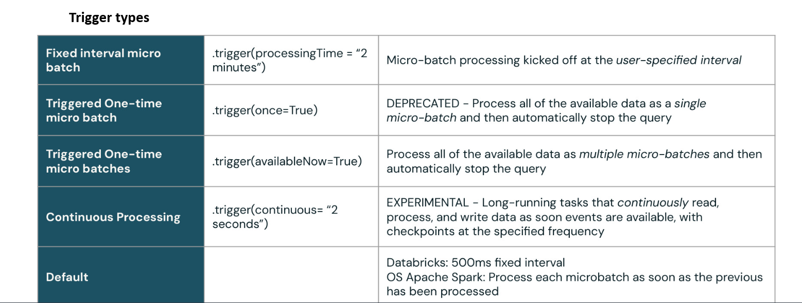
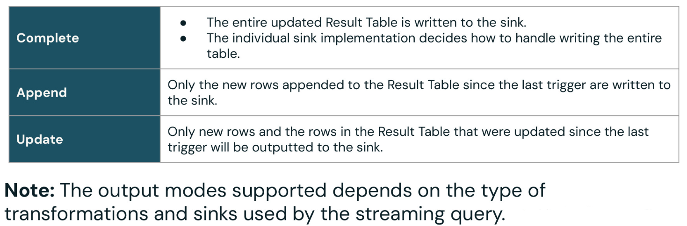

## Stream vs Batch Tables

Stream table: Continuously processes new data as it arrives (e.g., from Kafka, Auto Loader, event hubs).

Batch table: Processes data in fixed chunks (snapshots or micro-batches). Runs once per batch execution.

**Stream** 

Python 👉 spark.readStream + @dlt.table → creates a streaming table.

```
import dlt
from pyspark.sql.functions import col

@dlt.table(
    table_properties={"quality": "bronze"},
    comment="A streaming bronze table"
)
@dlt.expect("valid_id", "id IS NOT NULL")
def bronze_stream():
    return (
        spark.readStream.format("cloudFiles")  # or Kafka, Delta, etc.
        .option("cloudFiles.format", "json")
        .load("/mnt/raw/bronze-data")
    )
```

SQL 👉 The keyword STREAMING LIVE TABLE = streaming table.

```
CREATE OR REFRESH STREAMING TABLE bronze_stream
COMMENT "A streaming bronze table"
TBLPROPERTIES ("quality" = "bronze")
SCHEDULE EVERY 1 HOUR
AS SELECT * 
FROM cloud_files("/mnt/raw/bronze-data", "json");
```

**Batch** 

Python 👉 spark.read (no Stream) → creates a batch table.

```
import dlt

@dlt.table(
    table_properties={"quality": "silver"},
    comment="A batch silver table"
)
def silver_batch():
    return (
        spark.read.format("delta")  # not readStream
        .load("/mnt/bronze/processed")
    )
```

SQL 👉 The keyword LIVE TABLE (without STREAMING) = batch table.

```
CREATE OR REFRESH LIVE TABLE silver_batch
COMMENT "A batch silver table"
TBLPROPERTIES ("quality" = "silver")
AS SELECT *
FROM delta.`/mnt/bronze/processed`;
```

So the difference in both Python & SQL is:

- Use spark.readStream / STREAMING LIVE TABLE for streaming.
- Use spark.read / LIVE TABLE for batch.

## Example Python

```
(
    spark.table("sales")
    .withColumn("avgPrice", col("sales") / col("units"))
    .writeStream
    .format("delta")
    .option("checkpointLocation", checkpointPath)
    .outputMode("append")
    .table("cleanedSales")
)
 ```

`spark.table("sales")` -> Reads from an existing table called sales.
- If sales is a streaming source (like a Delta table being written to by a stream, Kafka, Auto Loader…), this will return a streaming DataFrame.
- If sales is just a static Delta table, it’s treated as a batch DataFrame.

`.withColumn("avgPrice", col("sales") / col("units"))` -> Adds a calculated column avgPrice = sales ÷ units.

`.writeStream` -> This is the key part: it turns the pipeline into a streaming query.
- So this block is writing results continuously, not just once.

`.option("checkpointLocation", checkpointPath)` -> Tells Spark where to keep the streaming state and progress info.
- Essential for fault tolerance and exactly-once guarantees.

`.outputMode("append")` -> Only new rows are appended to the sink table (cleanedSales)

`.table("cleanedSales")` -> Writes the stream output into a Delta table called cleanedSales.
- That table is a streaming sink, so it will be updated as new events come in


Types of tables here
- sales: depends on how it’s defined: If it’s fed by a streaming source → streaming input table. If it’s static → Spark will treat it like a batch input (but you rarely see .writeStream from static data).

- cleanedSales: definitely a streaming table because it’s the sink of .writeStream. It will keep receiving new rows in real time as Spark processes the stream.


## Example SQL

In SQL you don’t explicitly call .writeStream, .checkpointLocation, etc. Instead, you declare a streaming table, and Databricks handles the streaming write + checkpointing for you.

```
CREATE OR REFRESH STREAMING LIVE TABLE cleanedSales
COMMENT "Streaming table with average price per sale"
TBLPROPERTIES ("quality" = "silver")
AS
SELECT
  sales,
  units,
  sales / units AS avgPrice
FROM STREAM sales;
```

- `STREAMING LIVE TABLE` → declares that cleanedSales is a streaming table.
- `STREAM sales` → reads from the streaming source table sales.
- The expression sales / units AS avgPrice is your computed column.
- No need to manage .writeStream, checkpoint, or output mode → DLT handles it.
- So in SQL you only describe the transformation logic, while in Python Structured Streaming you explicitly manage the streaming write.

If sales is a Delta table (static / batch), then you don’t need the `STREAM` wrapper or `STREAMING LIVE TABLE`. Instead, you define a batch table.
```
CREATE OR REFRESH LIVE TABLE cleanedSales
COMMENT "Batch table with average price per sale"
TBLPROPERTIES ("quality" = "silver")
AS
SELECT
  sales,
  units,
  sales / units AS avgPrice
FROM LIVE.sales;
```
- `LIVE TABLE` → batch table (executed each pipeline run, not continuously).
- `LIVE.sales` → references the batch Delta table sales.
- No STREAM() and no STREAMING LIVE TABLE, because sales is not a streaming source.
- The resulting cleanedSales table is also batch, refreshed each run.


## spark.read.format vs spark.read.table
If sales is just a Delta table (not a streaming source), then you read it
- `df = spark.read.format("delta").load("/mnt/path/to/sales")` return a batch DataFrame (one-time snapshot).
- `df = spark.readStream.format("delta").load("/mnt/path/to/sales")` return a stream Dataframe (incremental consumption)

or, since it’s already registered in the metastore:
- `df = spark.read.table("sales")` return a batch DataFrame
- `df = spark.readStream.table("sales")`  return a stream Dataframe (incremental consumption)


## Stream and batch outside DLT
- You can create and use batch and stream tables without DLT.
- You can orchestrate them in Workflows (just schedule notebooks/scripts that use .read/.readStream).
- The main trade-off: outside DLT, you’re responsible for pipeline reliability (checkpoints, schema evolution, error handling).


### Outside DLT: Plain Spark / Structured Streaming

You can build stream and batch pipelines directly with PySpark / SQL:

**Batch example (outside DLT)**

*Python*
```
df = spark.read.format("delta").table("sales")   # batch read

df.withColumn("avgPrice", df.sales / df.units).write.format("delta").mode("overwrite").saveAsTable("cleanedSales_batch")
```
👉 sales and cleanedSales_batch here are batch tables.

*SQL*

For SQL, when you’re not in DLT, you don’t use LIVE TABLE or STREAMING LIVE TABLE. Instead, you just create or insert into a regular Delta table.
```
-- Create a new Delta table cleanedSales_batch from sales
CREATE OR REPLACE TABLE cleanedSales_batch
AS
SELECT
  sales,
  units,
  sales / units AS avgPrice
FROM sales;
```
👉 This is a batch query: It runs once (snapshot of sales at query time).No streaming involved.

If you want to refresh it periodically, you’d wrap that SQL in a Workflow (Job) that runs, say, every 30 minutes:
```
INSERT OVERWRITE TABLE cleanedSales_batch
SELECT
  sales,
  units,
  sales / units AS avgPrice
FROM sales;
```
INSERT OVERWRITE keeps the table fresh each run. The Workflow scheduler handles the recurrence.


**Stream example (outside DLT)**

*Python*
```
(
    spark.readStream.table("sales")                  # streaming read
    .withColumn("avgPrice", col("sales") / col("units"))
    .writeStream
    .format("delta")
    .option("checkpointLocation", "/mnt/checkpoints/cleanedSales")
    .outputMode("append")
    .table("cleanedSales_stream")
    .start()
    .awaitTermination()  # method used to keep the streaming query running until it is manually stopped.
)
```
👉 cleanedSales_stream is a streaming table, continuously updated.

*SQL*
```
CREATE OR REPLACE STREAMING TABLE cleanedSales_stream
COMMENT "Streaming table with average price"
TBLPROPERTIES ("delta.checkpointLocation" = "/mnt/checkpoints/cleanedSales")
AS
SELECT
  sales,
  units,
  sales / units AS avgPrice
FROM STREAM sales;
```

- `CREATE OR REPLACE STREAMING TABLE` → declares the sink (cleanedSales_stream) as a streaming Delta table.
- `STREAM sales` → treats the source table sales as a streaming input (new rows consumed incrementally).
- `TBLPROPERTIES ("delta.checkpointLocation" = "...")` → specifies the checkpoint location, just like .option("checkpointLocation", ...) in PySpark.

- This is not DLT, just SQL + Structured Streaming.
- The job keeps running until stopped (continuous streaming).
- You’d normally schedule this inside a Workflow with a “continuous” task, so the stream keeps running on a cluster.

### Using them in Workflows (Jobs)
- In Workflows, you schedule notebooks, Python scripts, or SQL queries.
- These can run batch jobs (using spark.read / .write) or launch streaming queries (using spark.readStream / .writeStream).
- If you launch a streaming query in a job, the cluster will stay running while the stream runs (continuous mode) or you can manage micro-batches depending on your design.


### Difference vs DLT
- DLT: declarative, manages lineage, quality rules, checkpoints, retries automatically.
- Outside DLT (Workflows, Notebooks): you must manage checkpointing, retries, monitoring yourself.


## Structured Streaming job
A Structured Streaming job in Spark / Databricks is a long-running process that continuously consumes new data from a streaming source (Delta table, Kafka, cloud files, etc.), applies transformations, and writes the results to a streaming sink (Delta table, console, files, or other targets).

Key characteristics:
- Incremental processing: only processes new data since last run.
- Fault tolerant: uses checkpoints to recover state.
- Output modes: append, update, complete.
- Think of it as batch processing applied continuously to micro-batches of new data.

In short: a Structured Streaming job is a running pipeline that continuously reads, transforms, and writes streaming data.

### Example: Python Structured Streaming Job
```
from pyspark.sql import SparkSession
from pyspark.sql.functions import col

spark = SparkSession.builder.getOrCreate()

# 1️⃣ Read streaming data from a Delta table or folder
sales_stream = spark.readStream.format("delta").table("sales")

# 2️⃣ Transformation
cleaned_stream = sales_stream.withColumn("avgPrice", col("sales") / col("units"))

# 3️⃣ Write streaming output to a Delta table (sink)
query = (
    cleaned_stream.writeStream
    .format("delta")
    .option("checkpointLocation", "/mnt/checkpoints/cleanedSales")
    .outputMode("append")   # only append new rows
    # .trigger(once=True)  # Uncomment this line if you want to trigger the job only once
    .table("cleanedSales_stream")
)

# 4️⃣ Start the streaming job
query.awaitTermination(timeout=None)   # keeps the job running indefinitely
```
Explanation:
- `readStream` → streaming source
- `writeStream` → streaming sink
- `checkpointLocation` → allows fault-tolerant recovery
- `awaitTermination()` → the job keeps running
- Without .trigger, Spark will keep running continuously until you stop it manually.

*Streaming job with .trigger*

```
from pyspark.sql import SparkSession
from pyspark.sql.functions import col

spark = SparkSession.builder.getOrCreate()

checkpointPath = "/tmp/checkpoints"

(
    spark.table("sales")
    .withColumn("avg_price", col("sales") / col("units"))
    .writeStream
    .option("checkpointLocation", checkpointPath)
    .outputMode("complete")
    .trigger(once=True)  # ← triggers the stream only once, acts like a micro-batch
    .format("delta")
    .table("new_sales")
)
```
- `.trigger(once=True)` tells Spark run the streaming query only once, process all available data, and then stop.
- Without .trigger, Spark will keep running continuously until you stop it manually.

### Example: SQL Structured Streaming Job
```
-- Create a streaming Delta table that consumes a streaming source
CREATE OR REPLACE STREAMING TABLE cleanedSales_stream
COMMENT "Streaming table with average price"
TBLPROPERTIES ("delta.checkpointLocation" = "/mnt/checkpoints/cleanedSales")
AS
SELECT
  sales,
  units,
  sales / units AS avgPrice
FROM STREAM sales;
```
Explanation:
- `STREAM(sales)` → treats sales as a streaming source
- `STREAMING TABLE` → the output sink is continuously updated
- `delta.checkpointLocation` → required for fault tolerance
- This SQL statement, once run, starts a Structured Streaming job behind the scenes that continuously processes new data.


## spark.table() vs spark.read.table()
There is no difference between spark.table() & spark.read.table() function. Actually, spark.read.table() internally calls spark.table().

I understand this confuses why Spark provides these two syntaxes that do the same. Imagine, spark.read which is object of DataFrameReader provides methods to read several data sources like CSV, Parquet, Text, Avro e.t.c, so it also provides a method to read a table.

As you learned both are exactly the same and are used to read the table into DataFrame.

https://sparkbyexamples.com/spark/spark-spark-table-vs-spark-read-table/


## spark.table() vs spark.readStream.format("delta").table("sales")

`df = spark.table("sales")` :
- This reads the table as a batch table by default.
- If sales is a Delta table, it just reads the current snapshot of data.
- No streaming is implied here. If you write this to a writeStream, Spark will try to treat it as static input, which works with .trigger(once=True) but isn’t a continuous stream.

`df = spark.readStream.format("delta").table("sales")` :
- This explicitly tells Spark: “treat sales as a streaming source.”
- Spark will continuously monitor the Delta table for new data and process it in micro-batches.
- This is the proper way to create a real streaming query on a Delta table.


## spark.readStream.format("cloudFiles")
you can use spark.readStream.format("cloudFiles") in a normal streaming job, it is not limited to DLT.
What cloudFiles is: 
- cloudFiles is part of Autoloader, Databricks’ optimized streaming/batch ingestion for files in cloud storage (S3, ADLS, GCS).
- It automatically detects new files in a folder and ingests them incrementally.
- Works for both streaming and batch reads.

**Usage in a streaming job**
```
from pyspark.sql import SparkSession

spark = SparkSession.builder.getOrCreate()

checkpointPath = "/tmp/checkpoints"

df = (
    spark.readStream.format("cloudFiles")
    .option("cloudFiles.format", "parquet")  # or csv, json, delta, etc.
    .option("cloudFiles.inferColumnTypes", "true")
    .load("/mnt/data/sales/")
)

(
    df.withColumn("avg_price", df["sales"] / df["units"])
    .writeStream
    .format("delta")
    .option("checkpointLocation", checkpointPath)
    .outputMode("append")
    .table("new_sales")
)
```
This will continuously watch the folder /mnt/data/sales/ for new files and process them as they arrive.

DLT vs normal streaming:
- In DLT, you often use cloudFiles in your pipeline to ingest files.
- But nothing in Autoloader requires DLT — it’s fully compatible with normal PySpark Structured Streaming jobs.

So the takeaway:
- cloudFiles = Autoloader = file-based incremental ingestion
- Can be used in any streaming job, DLT or not.


Structured Streaming job to read from a table, manipulate the data, and then perform a streaming write into a new table.
```
(spark.table("sales")
.withColumn("avg_price", col("sales") / col("units"))
.writeStream
.format("delta")
.option("checkpointLocation", checkpointPath)
.outputMode("complete")
.trigger(once=True)
.table("new_sales")
)
```



