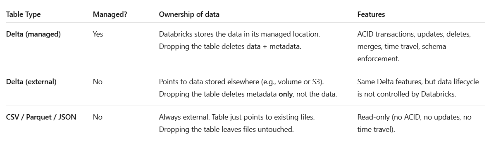

## Volume

In Databricks, a volume is essentially an abstraction over cloud storage, but with some additional databricks management features.

A volume is a managed cloud storage location that your Databricks workspace can read from and write to. Volumes are backed by cloud storage: for example, AWS S3, Azure Data Lake Storage (ADLS), or Google Cloud Storage (GCS) depending on your cloud provider. You can think of a volume as a persistent file system that your notebooks and jobs can access across clusters. A Databricks volume is just a storage location, so you can store any file format you want, including: CSV (.csv), JSON (.json), Parquet (.parquet),  Delta Lake (.delta), Avro, ORC, or even plain text files. So the format of the data is independent of the volume itself, the volume just holds the files.

Databricks managed DBFS paths (/dbfs/...) include both temporary and persistent storage. A volume is persistent and can be shared across clusters or attached to a Unity Catalog table. It allows fine-grained access control with Unity Catalog.

Direct cloud storage (like an S3 bucket) can be accessed via APIs, but: You must manage credentials and access yourself, you might have inconsistent paths and naming across clusters.

Databricks volumes provide: A simpler mount point (/Volumes/...), persistent access without mounting manually every time, integration with Databricks permissions and Unity Catalog.


### Files in the volume
You can use them in Spark or SQL directly from the volume, for example:

```
# Reading CSV from a volume
df_csv = spark.read.csv("/Volumes/my_volume/data.csv", header=True, inferSchema=True)

# Reading JSON from a volume
df_json = spark.read.json("/Volumes/my_volume/data.json")

# Reading Parquet from a volume
df_parquet = spark.read.parquet("/Volumes/my_volume/data.parquet")
```

In Databricks SQL, you can read files directly from a volume using the SELECT * FROM with the USING clause. For example:

```
-- Reading CSV directly
SELECT *
FROM csv.`/Volumes/my_volume/data.csv`
OPTIONS (header "true", inferSchema "true");

-- Reading  JSON directly
SELECT *
FROM json.`/Volumes/my_volume/data.json`;

-- Reading Parquet directly
SELECT *
FROM parquet.`/Volumes/my_volume/data.parquet`;
```

You can also create a managed Delta table in Unity Catalog by reading the data from the CSV file located in the specified volume:
```
CREATE TABLE my_csv_table
AS SELECT * FROM csv.`/Volumes/my_volume/data.csv`;
```
The data from the CSV file is loaded into the Delta table, and the table is managed by Unity Catalog. This allows you to query and manage the data efficiently using Delta Lake features such as ACID transactions, schema enforcement, and time travel capabilities.


### Files outside the volume
To read a CSV file stored outside Databricks (e.g., in Azure Data Lake Storage) using Spark, you can use the spark.read.csv method with the full path to the CSV file. Here is an example in PySpark:
```
df = spark.read.csv("abfss://<container>@<storage-account>.dfs.core.windows.net/<path>/<file>.csv", header=True, inferSchema=True)
```

To read a CSV file stored outside Databricks (for example, in Azure Data Lake Storage), use the full abfss:// path with the read_files table-valued function or the CSV data source in SQL:
```
SELECT * FROM read_files(
  'abfss://<container>@<storage-account>.dfs.core.windows.net/<path>/<file>.csv',
  format => 'csv',
  header => true
)

-- or

SELECT * FROM csv.`abfss://<container>@<storage-account>.dfs.core.windows.net/<path>/<file>.csv`
```

### How querying a volume file directly compares with creating a Delta table

**Quering**

Pros:
- Quick and easy for ad-hoc queries.
- No table creation needed.
- Flexible: can read from any folder or file.

Cons:
- No indexing or optimization.
- Every query can read all files from scratch → slower on large datasets.
- Limited ACID guarantees.


**Creating table**

Pros:
- Optimized for performance: supports *Delta caching, Z-ordering, and partition pruning*.
- ACID transactions: safe concurrent reads/writes.
- Easier to update, delete, or merge data.
- Works well for streaming ingestion or incremental updates.

Cons:
- Requires one-time table creation.
- Slightly more setup than direct file queries.

*Delta caching, Z-ordering, and partition pruning* are optimization techniques used in Delta Lake to improve query performance and reduce the amount of data that needs to be read during query execution.
- Delta caching involves storing frequently accessed data in memory to speed up query processing. By caching data in memory, subsequent queries that access the same data can be executed faster since the data is readily available in memory without the need to read it from disk again. This technique is particularly useful for improving the performance of repeated queries on the same dataset.
- Z-Ordering is a technique used for multi-dimensional clustering in Delta Lake. It involves colocating related information in the same set of files based on the specified columns. By organizing data in a specific order, Z-Ordering optimizes data layout to improve query performance and reduce the amount of data that needs to be read. Z-Ordering can be beneficial when querying data based on columns with high cardinality and can significantly enhance data skipping algorithms, leading to improved query efficiency.
- Partition pruning is an optimization technique that reduces the amount of data scanned during query execution by skipping partitions that do not satisfy the query predicates. By analyzing the query filters and the partitioning scheme of the table, Delta Lake can eliminate unnecessary partitions from being scanned, focusing only on the relevant partitions that contain the data needed for the query. Partition pruning helps to minimize the amount of data read from storage, thereby improving query performance and reducing query processing time.


## Updating a Delta table created from volume files or from files in a external cloud storage
**Parquet files**

When you create a Delta table from Parquet files, the Delta table does not directly read the Parquet files. Instead, Delta adds a transaction log (_delta_log/) to track all changes. When performing UPDATE or INSERT operations, Delta does not modify the original Parquet file. Instead, it writes new Parquet files with the updated or inserted data, updates the transaction log to reference the new files, and marks the old files as obsolete. The Delta table always reflects the latest state, but the original Parquet files remain unchanged and are no longer referenced in the active Delta table view. The cleanup of old Parquet files is handled later via the VACUUM operation. It is important to note that directly modifying files in the volume outside of Delta can lead to inconsistencies in the Delta table

So when you create a managed Delta table from a Parquet file stored in a volume and insert new data into the Delta table, the original Parquet file remains unchanged. The Delta table will contain the new data that you inserted, and the original Parquet file will not be modified. The Delta table will maintain its own transaction log and version history, allowing you to track changes and perform time travel queries on the data. The new data inserted into the Delta table will be stored separately from the original Parquet file, ensuring data integrity and versioning within the Delta Lake architecture.


**Other format files (csv, json, etc.)**

When you create a Delta table from CSV files, for example, Delta reads the CSV files once when creating the table. The data from the CSV files is converted into Parquet files, which are stored in the same folder or a Delta-managed folder if a location is not explicitly specified. After the Delta table is created, any INSERT, UPDATE, or DELETE operations are performed on the Parquet files managed by Delta, not on the original CSV files. The original CSV files remain unchanged as Delta does not overwrite them. The Delta table maintains a transaction log in the _delta_log/ directory and references the new Parquet files for subsequent operations

So, when you create a managed Delta table from a CSV file and insert new data into the Delta table, the original CSV file is not modified. The Delta table stores its data separately and manages its own transaction log and data files. The original CSV remains unchanged.

After creating a Delta table from any file format (CSV, JSON, Parquet) and whether from a volume or external storage, all changes occur in the Delta-managed Parquet files. The original CSV or JSON files are not modified; Delta manages its own transaction log and data files separately from the original file.


### Managed Delta table from CSV in a Volume or from CSV in an external storage
Managed tables: Unity Catalog manages both the governance and the underlying data files. Data is stored in a Unity Catalog-managed location in your cloud storage. Managed tables always use the Delta Lake formtat or the Iceberg format and benefit from features like auto compaction, auto optimize, and metadata caching. They are recommended for most use cases.

Here we read the CSV in the volume, but when we create the Delta table **we do not specify a LOCATION**. Databricks will copy the data into a managed DBFS path (not in the volume anymore).
```
-- Managed delta table: data copied into Databricks-managed storage
CREATE TABLE managed_customers
USING DELTA  -- optional
AS
SELECT *
FROM csv.`/Volumes/catalog/schema/volume/raw/customers.csv`  
-- FROM csv.`abfss://<container>@<storage-account>.dfs.core.windows.net/<path>/<file>.csv`  If csv in an external storage:
OPTIONS (header "true", inferSchema "true");
```
Result:
- The data is stored in Unity Catalog managed storage, not at the original CSV location.
- The table is governed as a managed table by Unity Catalog, not an external table.
- You do not specify a LOCATION clause; Databricks manages the storage location automatically.
- The original CSV file is only used as a data source during table creation.
- Table stored in Databricks-managed path (like /user/hive/warehouse/managed_customers/).
- Dropping the table deletes both metadata + data.
- Original CSV in the volume remains untouched.


### External Delta table from CSV in an external storage or from CSV in a Volume
External tables: Unity Catalog manages access, but the data lifecycle and file layout are managed outside Databricks (by your cloud provider or other platforms). **You must specify a location** that is defined as a Unity Catalog external location. External tables support multiple formats (Delta, csv, Json, parquet) and are useful when you need to register existing data or require access from outside Databricks. Databricks recommends eventually migrating external tables to managed tables for full governance and performance benefits.

You cannot create an external table in a volume. Volumes are managed storage abstractions in Unity Catalog, and you should not use the CREATE TABLE ... LOCATION syntax to create external tables inside a volume path. Instead, you can create a managed table from data stored in a volume, or use external locations for external table

```
-- External table: data stays in the external path
CREATE [EXTERNAL] TABLE external_customers
USING DELTA
LOCATION 'abfss://<container>@<storage-account>.dfs.core.windows.net/<path>/';

INSERT INTO external_customers
SELECT *
FROM csv.`abfss://<container>@<storage-account>.dfs.core.windows.net/<path>/data.csv`  -- FROM  csv.`/Volumes/ctalog/schema/my_volume/data.csv`
OPTIONS (header 'true', inferSchema 'true');
```


## External table
Creating a table with USING CSV creates an external table that points to the CSV data source, not a managed table. Managed tables do not support the CSV format. You can create an external table in Databricks that points to data stored in DB like PostgreSQL. This is done through the JDBC connector. The table itself is external because the data remains in PostgreSQL, and Databricks only reads it when you query.

This creates an external table in Databricks that reads directly from PostgreSQL. Data always stored in PostgreSQL
```
CREATE TABLE postgres_sales
USING JDBC
OPTIONS (
  url "jdbc:postgresql://your-host:5432/yourdb",
  dbtable "public.sales",
  user "your_username",
  password "your_password",
  driver "org.postgresql.Driver"
);
```

This creates an external table over the CSV file in your Azure Data Lake Storage. The table will read directly from the specified CSV file each time you query it. You cannot insert, update, or delete data in this table; it is read-only. This just points the table at the CSV files.
```
CREATE TABLE my_csv_table
USING CSV
OPTIONS (
  --path 'abfss://<container>@<storage-account>.dfs.core.windows.net/<path>/data.csv',
  header 'true',
  inferSchema 'true'
)
LOCATION 'abfss://<container>@<storage-account>.dfs.core.windows.net/<path>/data.csv';
```
You cannot create an external table using the CSV data source and specify a LOCATION that is different from the actual CSV file path. The LOCATION clause should point directly to the CSV file or directory containing CSV files in your external storage. The path option is not needed when you use the LOCATION clause.

You cannot create an external table in a volume. Volumes are managed storage abstractions in Unity Catalog, and you should not use the CREATE TABLE ... LOCATION syntax or the CREATE TABLE ... USING CSV sintax to create external tables inside a volume path. Instead, you can create a managed table from data stored in a volume, or use external locations for external table. (You cannot create an external table on a file or directory inside a Unity Catalog volume. Unity Catalog enforces that tables and volumes cannot overlap)

In Databricks Unity Catalog, you cannot create an external table directly on a file inside a Volume. Volumes are meant for secure file storage, but tables have to be created from directories in external locations (cloud storage like S3, ADLS, GCS) or managed locations. Databricks only allows you to query files in Volumes using read or a view, not a table definition.This does not work:
```
CREATE TABLE my_table
USING CSV
OPTIONS (
  path '/Volumes/catalog/schema/volume/baby_names.csv',
  header 'true',
  inferSchema 'true'
  );
```
A Unity Catalog Volume is not the same as an external location.


Result:
- Delta transaction log + Parquet files live in the external storage.
- Dropping the table deletes only metadata — data files remain in the volume.
- Original CSV stays untouched.


Managed table → Delta files live in Databricks-managed DBFS; drop = data gone and metadata removed.

External table → Delta files live in your Volume; drop = only metadata removed, data remains.



## USING DELTA vs USING CSV
`CREATE TABLE mytable USING DELTA`

Storage format: Delta Lake format, built on top of Parquet.
- ACID transactions (safe concurrent reads/writes).
- Schema enforcement & evolution.
- Time travel (VERSION AS OF, TIMESTAMP AS OF).
- Efficient updates, deletes, and merges (MERGE INTO).
- Optimized for large-scale analytics.

Delta = managed, transactional, production-ready table format.

CSV = raw file format table, mostly for ingestion or exploration, not mutable or optimized for big data operations.

`CREATE TABLE mutable USING CSV`

Plain CSV files. This just points the table at the CSV files.
- No ACID transactions.
- No schema evolution or enforcement.
- Read-only style: you can query the CSV, but cannot efficiently update or delete rows.
- No time travel or advanced Delta features.

If you first created the table with USING CSV, you can later upgrade it: `CONVERT TO DELTA mycsvtable;`

`CREATE TABLE … USING CSV`→ points to raw files.

`CREATE TABLE … USING DELTA AS SELECT` → ingests CSV data into a proper Delta table.


# External table and Databricks catalog
Even though a external table, it still appears in the Databricks catalog. External tables show up in the catalog.
- Databricks stores metadata about the table in the catalog (database/schema, table name, columns, options).
- The catalog knows the table exists and where to find the original files.
- Querying the table: Databricks reads the data from the external CSV files
- Viewing in catalog UI: In the Databricks Data tab, you can see the external table under the schema/database where you created it, marked as external if you check the details.
- Dropping the table: Only metadata is removed from the catalog.